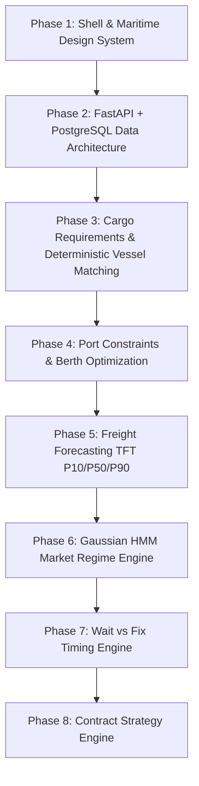

# FREIGHT IQ — Maritime Logistics Decision Support System
**Smart India Hackathon 2026 — Problem Statement SIH26006**  
**Client / Ministry**: Ministry of Steel / Steel Authority of India Limited (SAIL)  
**Theme**: Transportation & Logistics (Bulk Cargo Procurement & Vessel Chartering)

---

## 1. Executive Summary

**FREIGHT IQ** is an enterprise-grade maritime decision-support platform designed for bulk raw material procurement (coking coal, thermal coal, limestone, dolomite, iron ore) from overseas load ports (e.g., Newcastle, Gladstone, Richards Bay) to East Coast of India discharge ports (Paradip, Haldia, Visakhapatnam).

The platform addresses the core challenge of SIH26006: transitioning from fragmented, repeated spot-market vessel chartering toward optimized, risk-controlled multiple-voyage procurement strategies.

---

## 2. Architecture & Completed Phases



- **Phase 1**: Product shell, enterprise dark-mode maritime UI tokens, navigation, status badges.
- **Phase 2**: FastAPI backend, PostgreSQL / SQLite engine, SQLAlchemy models, Alembic migrations.
- **Phase 3**: Cargo requirements management, operational bulker snapshots, rule-based deterministic matching.
- **Phase 4**: Port constraints database (LOA, beam, draft, air draft, DWT, CSU handling rates), feasibility optimizer (PASS / CONDITIONAL / FAIL / UNKNOWN).
- **Phase 5**: Freight rate forecasting with baseline persistence, moving averages, and Temporal Fusion Transformer (TFT) quantile projections (P10, P50, P90).
- **Phase 6**: Market regime detection engine using Continuous Gaussian Hidden Markov Models (HMM) classifying BULL, BEAR, NEUTRAL, and SEASONAL states.
- **Phase 7**: Wait vs Fix charter-timing decision engine with scenario economics, waiting risk models, and Black-76 postponement flexibility valuation.
- **Phase 8 (Current)**: Contract Strategy Engine modeling SPOT vs. SHORT-TERM vs. MEDIUM-TERM multiple-voyage procurement allocations.

---

## 3. Phase 8 — Contract Strategy Engine Architecture

### 3.1 Objective
Move procurement decisions away from repeated single-voyage spot fixtures toward structured multi-voyage procurement programs (Contracts of Affreightment / COAs) to minimize freight volatility exposure.

> [!IMPORTANT]
> **Decision Support Notice**: This engine is a quantitative strategy simulator. It does **not** generate binding legal charter parties, provide legal counsel, or guarantee future cost savings.

### 3.2 Strategy Classifications

| Strategy | Commitment Horizon | Planned Voyages | Volume Coverage | Market Exposure | Operational Flexibility |
| :--- | :--- | :--- | :--- | :--- | :--- |
| **SPOT** | Single / Prompt Voyage | 1-by-1 (up to $N$) | 0% Contracted (100% Spot) | **High (100%)** | **High (95%)** |
| **SHORT-TERM MULTI-VOYAGE** | ~90 Days | 2–3 Voyages | ~50% Contracted | **Moderate (45%)** | **Moderate (58%)** |
| **MEDIUM-TERM MULTI-VOYAGE** | ~180 Days | 4+ Voyages | 100% Contracted | **Minimal (5%)** | **Low (20%)** |

### 3.3 Core Mathematical Formulations

#### 1. Voyage Planning & Remainder Preservation
$$\text{Expected Voyages} = \left\lceil \frac{\text{Total Requirement MT}}{\text{Voyage Parcel MT}} \right\rceil$$
$$\text{Remainder MT} = \text{Total Requirement MT} \pmod{\text{Voyage Parcel MT}}$$
*Guarantees zero cargo loss; remainder cargo is explicitly tracked as a final partial voyage.*

#### 2. Hybrid Portfolio Coverage Allocation
For any target coverage percentage $C \in [0, 100]$:
$$\text{Contracted MT} = \text{Total MT} \times \frac{C}{100}$$
$$\text{Spot MT} = \text{Total MT} - \text{Contracted MT}$$
$$\text{Expected Freight Cost} = (\text{Contracted MT} \times R_{\text{contract}}) + (\text{Spot MT} \times E[R_{\text{spot}}])$$

#### 3. Risk-Adjusted Total Cost
$$\text{Risk-Adjusted Cost} = \text{Expected Freight Cost} + \text{Uncertainty Penalty} + \text{Commitment Penalty}$$
- **Uncertainty Penalty**: $0.50 \times \max(0, P90_{\text{spot}} - P50_{\text{spot}}) \times \text{Spot MT}$  
  *(Penalizes uncommitted tonnage exposed to upside freight rate spikes).*
- **Commitment Penalty**: $0.02 \times \text{Contract Freight Cost} \times \left(1 + \frac{T_{\text{days}}}{365}\right)$  
  *(Penalizes rigid forward volume lock-in and forfeiture of cancellation optionality).*

#### 4. Modeled Break-Even Spot Rate
$$\text{Break-Even Rate} = R_{\text{contract}}$$
If average forward spot rates over the planning horizon exceed $R_{\text{contract}}$, the multi-voyage contract provides modeled cost savings relative to repeated spot exposure.

---

## 4. API Endpoints (Phase 8)

| Method | Endpoint | Description |
| :--- | :--- | :--- |
| `POST` | `/api/v1/contracts/analyze` | Evaluates SPOT, SHORT-TERM, and MEDIUM-TERM strategies, scenario matrices, and voyage schedules. |
| `GET` | `/api/v1/contracts/{id}` | Retrieves a persisted strategy evaluation record by ID. |
| `GET` | `/api/v1/contracts/{id}/comparison` | Retrieves full portfolio comparison across all 3 strategies. |
| `GET` | `/api/v1/contracts/{id}/scenarios` | Retrieves BEAR, BASE, BULL outcome scenarios for a strategy. |
| `GET` | `/api/v1/contracts/{id}/break-even` | Computes modeled break-even spot rate threshold. |
| `POST` | `/api/v1/contracts/coverage` | Interactive 0% to 100% portfolio coverage slider simulation. |

### Example API Request
```bash
curl -X POST http://127.0.0.1:8000/api/v1/contracts/analyze \
  -H "Content-Type: application/json" \
  -d '{
    "total_requirement_mt": 300000,
    "parcel_size_mt": 75000,
    "origin_port_id": "newcastle-au",
    "destination_port_id": "paradip-in",
    "cargo_type": "COKING_COAL",
    "vessel_class": "PANAMAX",
    "planning_horizon_days": 180,
    "reference_contract_rate": 24.00
  }'
```

---

---

## 5. Phase 9 — Idle Scenario & Repositioning Intelligence

FREIGHT IQ Phase 9 implements an evidence-driven vessel employment intelligence module designed for the Ministry of Steel & SAIL (SIH 2026 #SIH26006) to minimize vessel idle time, forecast demand gaps, identify alternative employment, and optimize ballast positioning without deadheading.

### 5.1 Employment State Machine (9 Evidence-Driven States)
Vessel transitions are strictly evidence-driven. States are never inferred from insufficient records:
1. `EMPLOYED`: Active laden voyage transit (remaining duration > 72 hours).
2. `VOYAGE_COMPLETING`: Approaching discharge port (within 72 hours) or actively discharging at berth.
3. `AVAILABLE`: Discharge completed and open for employment without fixed subsequent fixture.
4. `NEXT_EMPLOYMENT_PENDING`: Open with confirmed subsequent fixture scheduled.
5. `IDLE_RISK`: Open or completing without verified next employment within prompt window (<= 3 days).
6. `IDLE`: Open at port or anchorage beyond prompt window (> 3 days) without fixture.
7. `REPOSITIONING`: Steaming under ballast transit to position for a verified loading port.
8. `ALTERNATIVE_EMPLOYMENT`: Evaluating or fixed on an alternative mitigating cargo requirement.
9. `UNKNOWN`: Unverified particulars or incomplete tracking records.

### 5.2 Strict Data Integrity & Provenance
- **Dataset Coverage**: Displays exact dataset-backed counts (e.g., `9 vessels in current dataset`). Never implies global AIS fleet coverage without certified stream licenses.
- **Potential Idle Days**:
  $$\text{Potential Idle Days} = \text{Next Employment Time} - \text{Available Time}$$
  Only computed if both timestamps are supported. Otherwise, `idle_days = UNKNOWN` (None). Never substitute zero.
- **Modeled Idle Cost**:
  $$\text{Idle Cost} = \text{Idle Days} \times \text{Daily Vessel Cost}$$
  Daily vessel cost must come from sourced charter rates, calibrated OPEX, or explicit user assumptions. If unrecorded, displays `DAILY VESSEL COST: NOT AVAILABLE`.
- **Route Distance & Labeling**:
  Checked against database `FreightRoute` nautical records (`NAUTICAL_CHART`). If unavailable, falls back to great-circle Haversine formula and is explicitly labeled `GEODESIC APPROXIMATION`. Never mislabeled as certified nautical chart distance.
- **Bunker Economics**:
  $$\text{Bunker Cost} = (\text{Fuel Consumption (MT/day)} \times \text{Sailing Days}) \times \text{Bunker Price (\$/MT)}$$
  If consumption or price is unavailable, returns `UNAVAILABLE`.
- **Revenue Integrity**:
  Commercial freight revenue is not fabricated if unrecorded in the requisition. The economic comparison between WAIT and REPOSITION returns `ECONOMIC_COMPARISON_INCOMPLETE`.

### 5.3 Deadhead Risk Scoring Rules
- `UNKNOWN`: Incomplete distance, unverified berth clearances, or missing laycan dates.
- `HIGH`: Target port physically rejects vessel (berth constraint FAIL), arrival misses laycan canceling date, or speculative ballast exceeds 2,500 NM without confirmed cargo.
- `MEDIUM`: Ballast transit between 1,500 NM and 3,000 NM with tight laycan buffer (< 1.5 days) or conditional tidal clearance.
- `LOW`: Short ballast leg (<= 1,500 NM) with full berth clearance and secure on-time laycan arrival.

### 5.4 Phase 9 APIs
- `GET /api/v1/idle/vessels`: Fleet overview, dataset-backed counts, and vessel employment roster.
- `GET /api/v1/idle/scenarios`: All detected or evaluated idle exposure scenarios.
- `GET /api/v1/idle/scenarios/{id}`: Single idle scenario record.
- `POST /api/v1/idle/analyze`: Comprehensive single-vessel idle analysis, alternative cargo search, and economic trade-off comparison.
- `POST /api/v1/repositioning/analyze`: Detailed evaluation of a specific ballast leg.
- `GET /api/v1/repositioning/{vessel_id}/options`: Recorded repositioning options for a vessel.
- `GET /api/v1/vessels/{id}/employment-timeline`: Lifecycle employment timeline with verified events.

---

## 6. Demonstration Dataset & Verification Scenario

- **Cargo Requirements**:
  - `CR-2026-001`: 75,000 MT Coking Coal, Newcastle Port -> Paradip Port (Panamax/Kamsarmax)
  - `CR-2026-002`: 65,000 MT Thermal Coal, Gladstone Port -> Visakhapatnam Port
- **Dataset Vessels**: 9 vessels (6 SAIL Operational Snapshot vessels + 3 commercial bulkers)
  - `Vishva Vijay`: Kamsarmax, Open Singapore, Ballast Repositioning to Newcastle ($14,000/d daily cost assumption)
  - `Lyric Harmony`: Supramax, Paradip Anchorage, Port Delay scenario (unknown next fixture)
  - `Pu An Tong`: Supramax, Discharging at Paradip Berth CB-1
  - `Red Cosmos`: Panamax, Unverified particulars (strictly evaluates to UNKNOWN)

---

## 7. Testing & Quality Verification

Run the full automated test suite:
```bash
# Run all backend tests across Phases 1-9 (51 passing tests)
cd backend
python -m pytest app/tests/ -v

# Run frontend typecheck
cd ..
npx tsc --noEmit

# Run frontend production build
npm run build
```

---

## 8. Disclosures & Strict Non-Implementation Scope

In accordance with SIH26006 architectural boundaries, the following are intentionally reserved for subsequent phases:
- No automated vessel booking or charter party execution
- No legal charter party clause arbitration
- No live global fleet AIS tracking without certified stream licenses
- No AI Copilot or conversational chat recommendations
- No weather-routing or tidal dynamic navigation (Phase 10)
