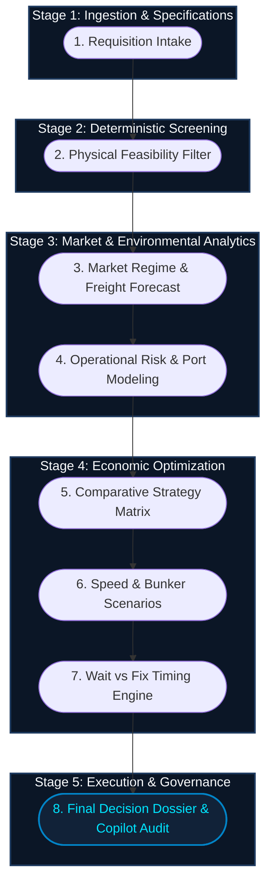
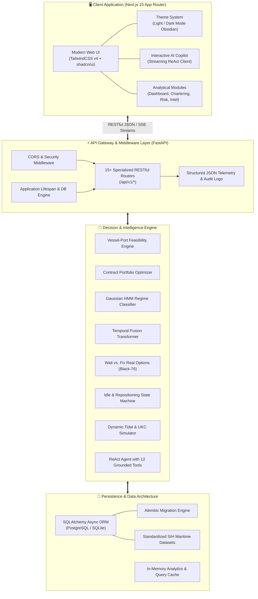
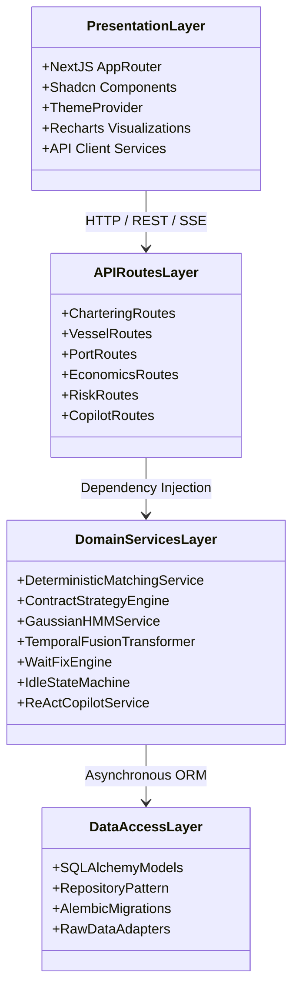
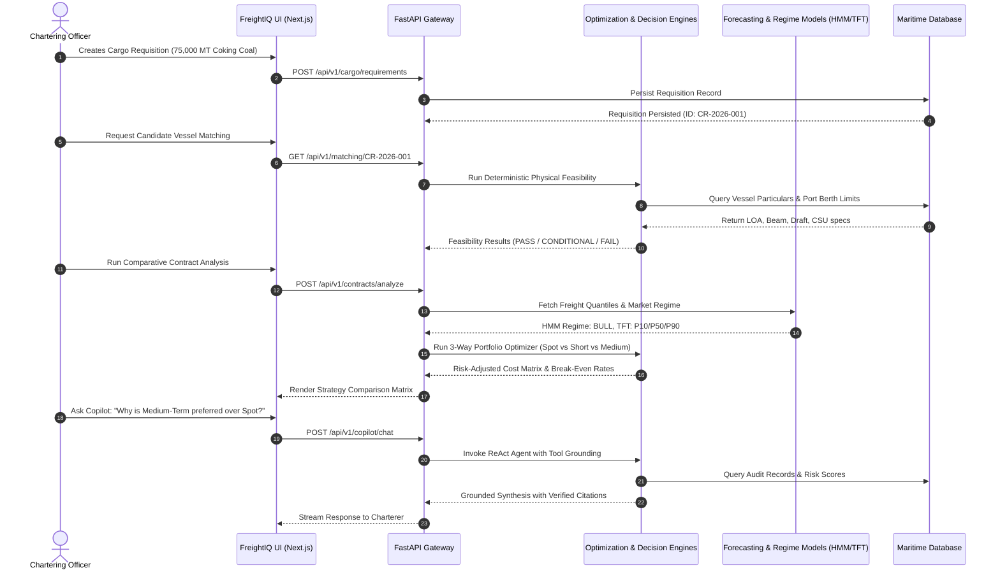

# ⚓ FREIGHT IQ — Maritime Freight Intelligence & Chartering Decision Support Platform

<div align="center">

[](https://sih.gov.in)
[](https://nextjs.org)
[](https://fastapi.tiangolo.com)
[](https://www.typescriptlang.org)
[](https://tailwindcss.com)
[](https://www.sqlalchemy.org)
[](#)

<p align="center">
  <strong>An Enterprise Decision-Support System for Dry-Bulk Raw Material Procurement & Coastal Fleet Optimization</strong><br>
  Built for the <strong>Ministry of Steel</strong> & <strong>Steel Authority of India Limited (SAIL)</strong>
</p>

[System Workflow](#2-end-to-end-system-workflow-work-process-a-z) •
[Maritime Glossary](#3-maritime--quantitative-glossary-key-terms-explained) •
[Features Deep-Dive](#4-feature-by-feature-deep-dive) •
[System Architecture](#5-architecture--engineering) •
[Tech Stack](#6-technology-stack) •
[Developer Onboarding](#8-new-developer-onboarding-guide)

</div>

---

## 📑 Table of Contents

- [1. Executive Summary & Problem Statement](#1-executive-summary--problem-statement)
- [2. End-to-End System Workflow (Work Process A to Z)](#2-end-to-end-system-workflow-work-process-a-z)
- [3. Maritime & Quantitative Glossary (Key Terms Explained)](#3-maritime--quantitative-glossary-key-terms-explained)
- [4. Feature-by-Feature Deep Dive](#4-feature-by-feature-deep-dive)
  - [4.1 Executive Overview Dashboard (`/dashboard`)](#41-executive-overview-dashboard-dashboard)
  - [4.2 Cargo Requisitions & Intake (`/chartering/requests`, `/chartering/new`)](#42-cargo-requisitions--intake-charteringrequests-charteringnew)
  - [4.3 Deterministic Vessel-Port Feasibility Engine (`/chartering/vessels`)](#43-deterministic-vessel-port-feasibility-engine-charteringvessels)
  - [4.4 3-Way Comparative Chartering Matrix & Decision Workspace (`/chartering/comparison`, `/chartering/decision/[id]`)](#44-3-way-comparative-chartering-matrix--decision-workspace-charteringcomparison-charteringdecisionid)
  - [4.5 Spot vs. COA vs. Time Charter Optimizer (`/optimization/contracts`)](#45-spot-vs-coa-vs-time-charter-optimizer-optimizationcontracts)
  - [4.6 Idle Fleet Repositioning & Deadhead Risk Avoidance (`/optimization/idle`)](#46-idle-fleet-repositioning--deadhead-risk-avoidance-optimizationidle)
  - [4.7 Voyage Economics, Speed Break-Even & Bunker Calculator (`/optimization/speed`, `/optimization/voyage-cost`)](#47-voyage-economics-speed-break-even--bunker-calculator-optimizationspeed-optimizationvoyage-cost)
  - [4.8 Wait vs. Fix Timing Engine (`/intelligence/wait-fix`)](#48-wait-vs-fix-timing-engine-intelligencewait-fix)
  - [4.9 Port Congestion & Queue Time Prediction (`/intelligence/congestion`, `/intelligence/ports`)](#49-port-congestion--queue-time-prediction-intelligencecongestion-intelligenceports)
  - [4.10 Tidal Window & Dynamic Draft Navigator (`/intelligence/tidal`)](#410-tidal-window--dynamic-draft-navigator-intelligencetidal)
  - [4.11 Market Regime Detection (Gaussian HMM) & Freight Forecasting (TFT) (`/intelligence/regime`, `/intelligence/freight`)](#411-market-regime-detection-gaussian-hmm--freight-forecasting-tft-intelligenceregime-intelligencefreight)
  - [4.12 Operational Weather Risk & Safe Route Corridor (`/intelligence/weather`, `/risk`)](#412-operational-weather-risk--safe-route-corridor-intelligenceweather-risk)
  - [4.13 Grounded AI Maritime Copilot (`/ai/copilot`)](#413-grounded-ai-maritime-copilot-aicopilot)
  - [4.14 Data Ingestion & Governance (`/admin/ingestion`, `/admin/models`)](#414-data-ingestion--governance-adminingestion-adminmodels)
- [5. Architecture & Engineering](#5-architecture--engineering)
  - [5.1 High-Level System Architecture](#51-high-level-system-architecture)
  - [5.2 Software Layered Architecture](#52-software-layered-architecture)
  - [5.3 End-to-End Decision Pipeline Data Flow](#53-end-to-end-decision-pipeline-data-flow)
  - [5.4 Core Mathematical & Economic Formulations](#54-core-mathematical--economic-formulations)
- [6. Technology Stack](#6-technology-stack)
- [7. Repository Directory Layout](#7-repository-directory-layout)
- [8. New Developer Onboarding Guide](#8-new-developer-onboarding-guide)
  - [8.1 System Prerequisites](#81-system-prerequisites)
  - [8.2 Step-by-Step Installation](#82-step-by-step-installation)
  - [8.3 Database Initialization & Seeding](#83-database-initialization--seeding)
  - [8.4 Starting the Development Environment](#84-starting-the-development-environment)
  - [8.5 Running Verification & Test Suites](#85-running-verification--test-suites)
  - [8.6 Design System & Theme Guidelines](#86-design-system--theme-guidelines)
- [9. Data Provenance & Safety Boundaries](#9-data-provenance--safety-boundaries)
- [10. Contribution & Git Workflow](#10-contribution--git-workflow)

---

## 1. Executive Summary & Problem Statement

**FREIGHT IQ** is an enterprise-grade maritime intelligence and decision-support workstation engineered for **Smart India Hackathon 2026 (Problem Statement SIH26006)** under the **Ministry of Steel** and **Steel Authority of India Limited (SAIL)**.

### The Operational Challenge
Indian integrated steel plants consume millions of tons of imported coking coal, thermal coal, limestone, and dolomite annually. Typical procurement trade lanes originate in overseas load ports (e.g., **Newcastle** & **Gladstone** in Australia, **Richards Bay** in South Africa, and **Mormugao/Dhamra** domestically) delivering into Indian East Coast discharge ports (**Paradip**, **Haldia**, **Visakhapatnam**).

Traditionally, procurement teams suffer from:
1. **Repeated Spot-Fixture Volatility**: Fixing individual vessels opportunistically leads to massive demurrage expenses during freight rate surges and port congestion spikes.
2. **Sub-optimal Ballast & Idle Voyages**: Vessels returning empty (deadheading) without synchronized return or coastal coastal cargo allocations.
3. **Physical Berth & Tidal Incompatibilities**: High-tide dependent ports like Haldia require accurate under-keel clearance (UKC) modeling; fixing an incompatible draft vessel leads to expensive dead-freight or lighterage at sea.
4. **Lack of Probabilistic Timing Tools**: Charterers lack quantitative tools to decide whether to *fix promptly* or *wait* for softening market rates.

### The FreightIQ Solution
FREIGHT IQ integrates **deterministic physical engineering** with **probabilistic market intelligence**:
- Evaluates **SPOT**, **SHORT-TERM COA**, and **MEDIUM-TERM COA** contracts using risk-adjusted portfolio modeling.
- Employs **Continuous Gaussian Hidden Markov Models (HMM)** to identify macro freight regimes (`BULL`, `BEAR`, `NEUTRAL`, `SEASONAL_SURGE`).
- Projects future freight volatility via **Temporal Fusion Transformers (TFT)** generating quantile bounds ($P10, P50, P90$).
- Implements a **Black-76 Real Option** framework to quantify the value of postponing fixtures versus accumulating daily demurrage exposure.
- Enforces an **Evidence-Grounded AI Copilot** that refuses to hallucinate and cites strict database records for every tactical recommendation.

---

## 2. End-to-End System Workflow (Work Process A to Z)

The operational life cycle inside FREIGHT IQ follows an 8-stage decision pipeline designed for procurement directors, chartering officers, and voyage managers:



### Step-by-Step Walkthrough:
1. **Requisition Intake (`/chartering/new`)**:
   - The user inputs raw material specifications: cargo grade (e.g., Hard Coking Coal), parcel volume (e.g., 75,000 MT), load port (`Newcastle, AU`), discharge port (`Paradip, IN`), and the contract laycan window (`01 Oct – 10 Oct`).
2. **Physical Feasibility Filter (`/chartering/vessels`)**:
   - The deterministic engine evaluates all candidate bulkers against load/discharge berth constraints: Length Overall (LOA), Beam, Arrival Draft, Air Draft, Deadweight (DWT), and de-ballasting rates.
   - Classification output: `PASS`, `CONDITIONAL` (tidal or lighterage constraint), or `FAIL`.
3. **Market Regime & Freight Forecast (`/intelligence/regime`, `/intelligence/freight`)**:
   - Ingests Baltic Dry Index (BDI), BPI (Panamax), and bunker benchmark feeds.
   - Gaussian HMM determines whether the trade lane is entering a `BULL` run or `BEAR` softening.
   - TFT models output forward rate distributions for the laycan horizon ($P10 = \$13.20/\text{MT}, P50 = \$14.50/\text{MT}, P90 = \$16.80/\text{MT}$).
4. **Operational Risk & Port Modeling (`/intelligence/congestion`, `/intelligence/weather`)**:
   - Live queue simulation calculates expected pre-berthing wait times (e.g., Paradip CB-1 berth queue: 3.4 days).
   - Dynamic tidal curves calculate Under-Keel Clearance (UKC) to determine maximum permissible intake tonnage without grounding risk.
   - Cyclonic weather corridors (Bay of Bengal / Indian Ocean) flag potential sea-state delays.
5. **3-Way Comparative Strategy Matrix (`/chartering/comparison`)**:
   - Compares **Option A (Spot Single Fixture)**, **Option B (3-Month Short COA)**, and **Option C (6-Month Medium COA)** across risk-adjusted cost, volatility variance, and operational flexibility.
6. **Speed & Bunker Scenarios (`/optimization/speed`)**:
   - Simulates economic slow steaming (11.5 knots) vs. normal speed (13.0 knots) vs. full speed (14.5 knots).
   - Evaluates daily bunker consumption (VLSFO + LSMGO) vs. demurrage penalty tradeoffs ($/day).
7. **Wait vs. Fix Timing Engine (`/intelligence/wait-fix`)**:
   - Evaluates the financial trade-off between fixing immediately at prevailing market rates or waiting $N$ days for predicted rate softening, factoring in holding demurrage costs.
8. **Final Decision Dossier & Copilot Audit (`/chartering/decision/[id]`, `/ai/copilot`)**:
   - Generates a cryptographically tracked, printable decision dossier detailing complete provenance, risk waivers, and audit trails.
   - Chartering officers consult the AI Copilot for automated sensitivity auditing with direct database citations.

---

## 3. Maritime & Quantitative Glossary (Key Terms Explained)

To bridge dry bulk commercial shipping and quantitative modeling, FREIGHT IQ standardizes on industry-standard terminology:

### Commercial & Chartering Terms
| Term | Definition & Application in FREIGHT IQ |
| :--- | :--- |
| **Laycan (Laydays & Canceling)** | The contractual date range (e.g., `12-Oct to 18-Oct`) agreed between charterer and shipowner. The charterer is not obliged to commence loading before the first day; if the vessel fails to arrive before the canceling date/hour, the charterer reserves the unilateral right to cancel the charter party. |
| **Demurrage** | Liquidated damages payable by the charterer to the shipowner for failing to load or discharge cargo within the agreed laytime allowance (expressed in USD/day, e.g., `$18,000/day`). |
| **Despatch** | Incentive bonus paid by the shipowner to the charterer when cargo operations complete faster than the agreed laytime (typically 50% of the demurrage rate, e.g., `$9,000/day`). |
| **Deadweight Tonnage (DWT)** | The total maximum operational carrying capacity of a vessel in metric tons (including cargo, fuel, ballast water, fresh water, crew, and provisions) at maximum summer draft. |
| **TCE (Time Charter Equivalent)** | Standard shipping performance measure ($/day) defined as: $\text{TCE} = \frac{\text{Gross Freight Revenue} - \text{Voyage Expenses}}{\text{Round Voyage Days}}$. |
| **Spot Charter** | Single-voyage contract where freight is agreed on prevailing day rates for immediate movement. High market exposure, high spot volatility. |
| **COA (Contract of Affreightment)** | Long-term volume commitment where an owner agrees to transport specified aggregate cargo quantities (e.g., 600,000 MT) over multiple voyages at predetermined contractual freight rates. |
| **Time Charter (TC)** | Agreement to hire a vessel for an agreed duration (e.g., 6 months). Charterer directs commercial employment and pays fuel and port expenses; owner maintains vessel and crew. |
| **Ballast Voyage** | A transit leg where the ship sails empty of cargo, carrying only sea water ballast for stability to reach its next loading port. Non-revenue generating. |
| **Deadhead Voyage** | An unmitigated ballast return trip without backhaul or subsequent cargo, leading to unrecovered bunker and time costs. |

### Technical & Nautical Specifications
| Metric | Explanation |
| :--- | :--- |
| **LOA (Length Overall)** | Extreme physical length from bow to stern. Restricts access to berths with physical quay length caps. |
| **Beam** | The extreme width of the ship hull. Limits transit through locks and governs reach of Continuous Ship Unloaders (CSUs) or gantry cranes. |
| **Draft (Draught)** | Vertical distance from the waterline to the lowest point of the ship's keel. Varies dynamically between ballast condition (~6–8m) and fully laden summer draft (~14.5–18.5m). |
| **Air Draft** | Distance from the waterline to the highest point of the vessel's mast. Limits clearance under port loader conveyors, bridges, and overhead powerlines. |
| **UKC (Under-Keel Clearance)** | Safe minimum vertical margin between the deepest point of the keel and the seabed: $\text{UKC} = \text{Charted Depth} + \text{Tidal Height} - \text{Vessel Dynamic Draft}$. |
| **VLSFO / LSMGO** | Very Low Sulfur Fuel Oil (0.5% S) and Low Sulfur Marine Gas Oil (0.1% S) consumed during ocean transit and in-port auxiliary generator operations. |

### Quantitative & AI Terms
| Model / Term | Meaning in FreightIQ |
| :--- | :--- |
| **Gaussian HMM** | Hidden Markov Model with continuous Gaussian emission probabilities detecting latent market regimes (`BULL`, `BEAR`, `NEUTRAL`, `SEASONAL`) based on BDI velocity and momentum. |
| **TFT (Temporal Fusion Transformer)** | State-of-the-art deep learning architecture utilizing recurrent layers and self-attention to generate multi-horizon quantile freight forecasts ($P10, P50, P90$). |
| **Black-76 Postponement Value** | Adaption of the Black financial option model treating a delayed vessel fixture as a European call option on ocean freight, balancing market softening potential against daily port idling costs. |
| **ReAct Agent** | Reasoning + Acting framework powering the FreightIQ Copilot; breaks complex user inquiries into thought, tool selection, observation, and grounded synthesis with zero hallucination. |

---

## 4. Feature-by-Feature Deep Dive

### 4.1 Executive Overview Dashboard (`/dashboard`)
- **Purpose**: Unified maritime command cockpit displaying active requisitions, fleet disposition, market regime telemetry, port congestion indices, and urgent procurement alerts.
- **Key Metrics**:
  - `Fleet Employment Status`: Total tracked bulkers categorized into Employed, Repositioning, Idle Risk, and Available.
  - `Market Regime Indicator`: Live Gaussian HMM classification with confidence score (e.g., `BULL (Confidence 88%)`).
  - `Demurrage Exposure Risk`: Current calculated fleet demurrage liability across East Coast ports.
  - `Active Laycan Alerts`: Approaching canceling dates requiring immediate charter fixture action.

### 4.2 Cargo Requisitions & Intake (`/chartering/requests`, `/chartering/new`)
- **Purpose**: Centralized requisition lifecycle manager for steel plant procurement demands.
- **Features**:
  - New Requisition intake form validating cargo types (Hard Coking Coal, PCI Coal, Iron Ore Pellets, Dolomite).
  - Automated parcel sizing based on vessel class standards (Capesize ~150k MT, Kamsarmax ~82k MT, Panamax ~75k MT, Supramax ~58k MT).
  - Status progression: `DRAFT` $\rightarrow$ `ACTIVE` $\rightarrow$ `IN_EVALUATION` $\rightarrow$ `FIXED` $\rightarrow$ `COMPLETED`.

### 4.3 Deterministic Vessel-Port Feasibility Engine (`/chartering/vessels`)
- **Purpose**: Multi-constraint physical screening module preventing operational groundings and berth mismatches.
- **Evaluation Criteria**:
  - `LOA Check`: Compares vessel LOA against maximum berth capacity.
  - `Beam & Crane Outreach`: Verifies port CSU / grab crane outreach covers the vessel's beam.
  - `Draft vs. Charted Depth`: Computes static draft clearance.
  - `Tidal Dynamic Floatation`: Flags vessels that can only berth during spring high tides (`CONDITIONAL`).
  - Output: Rigorous four-state classification: `PASS`, `CONDITIONAL`, `FAIL`, or `UNKNOWN`.

### 4.4 3-Way Comparative Chartering Matrix & Decision Workspace (`/chartering/comparison`, `/chartering/decision/[id]`)
- **Purpose**: Quantitative decision bench comparing three procurement modalities for any cargo requisition:
  - **Strategy 1: Spot Market Fixture** (100% spot exposure, maximum flexibility, high upside volatility).
  - **Strategy 2: Short-Term Multi-Voyage COA (90 Days)** (50% volume hedged, moderate operational leeway).
  - **Strategy 3: Medium-Term Program COA (180 Days)** (100% volume fixed, lowest risk-adjusted cost, zero spot volatility).
- **Features**:
  - Dynamic radar chart visualizing Risk, Cost, Flexibility, and Carbon Footprint.
  - Risk-adjusted total cost breakdown including Uncertainty Penalties and Commitment Forfeiture costs.
  - Modeled Break-Even Spot Rate calculations.

### 4.5 Spot vs. COA vs. Time Charter Optimizer (`/optimization/contracts`)
- **Purpose**: Portfolio optimizer simulating hybrid commitment strategies.
- **Features**:
  - Interactive portfolio coverage slider ($0\%$ to $100\%$ contracted).
  - Monte Carlo scenario simulations under Bear (-20%), Base (Current), and Bull (+25%) rate surges.
  - Full remainder volume tracking guaranteeing zero cargo parcel loss across split voyages.

### 4.6 Idle Fleet Repositioning & Deadhead Risk Avoidance (`/optimization/idle`)
- **Purpose**: Real-time vessel employment intelligence tracking ballast transits and preventing deadhead losses.
- **Features**:
  - **9-State Employment State Machine**: Tracks vessel transitions from `EMPLOYED` to `VOYAGE_COMPLETING`, `AVAILABLE`, `NEXT_EMPLOYMENT_PENDING`, `IDLE_RISK`, `IDLE`, and `REPOSITIONING`.
  - **Deadhead Risk Scoring**: Categorizes ballast legs into `LOW`, `MEDIUM`, or `HIGH` risk based on transit distance, certified nautical routing, and confirmed backhaul viability.
  - Alternative employment matcher scanning open coastal cargo opportunities.

### 4.7 Voyage Economics, Speed Break-Even & Bunker Calculator (`/optimization/speed`, `/optimization/voyage-cost`)
- **Purpose**: Multi-variable voyage financial simulator computing delivered cost per metric ton.
- **Features**:
  - Speed-consumption cubic polynomial curve modeling fuel burn across Eco (11.5 kts), Normal (13.0 kts), and Full (14.5 kts).
  - Real-time bunker fuel price integration (Singapore / Fujairah VLSFO and LSMGO).
  - Speed break-even solver balancing daily fuel savings against port waiting demurrage penalties.

### 4.8 Wait vs. Fix Timing Engine (`/intelligence/wait-fix`)
- **Purpose**: Analytical timing framework for chartering officers facing volatile forward freight curves.
- **Features**:
  - **Real Options Valuation (Black-76)**: Quantifies the option value of delaying a fixture by 3, 5, or 7 days.
  - **Cost-of-Waiting Breakdown**: Tracks accumulating port anchorage idle fees and berth queue slippage.
  - Definitive recommendation: `FIX_NOW` vs. `WAIT_RECOMMENDED` with mathematically supported confidence metrics.

### 4.9 Port Congestion & Queue Time Prediction (`/intelligence/congestion`, `/intelligence/ports`)
- **Purpose**: Port operations intelligence analyzing turnaround times and queue risks across major Indian discharge terminals.
- **Features**:
  - Pre-berthing waiting time predictions for Paradip (CB-1, CB-2, IOBT), Haldia (Berths 4A/4B), and Vizag (EQ-1, WQ-1).
  - CSU handling rate monitoring (MT/day discharge productivity).
  - Port congestion risk index categorized into Low ($< 24\text{h}$), Medium ($24–72\text{h}$), and High ($> 72\text{h}$).

### 4.10 Tidal Window & Dynamic Draft Navigator (`/intelligence/tidal`)
- **Purpose**: Dynamic bathymetric navigation assistant for tidal ports (specifically Haldia and Hooghly river approaches).
- **Features**:
  - Semi-diurnal astronomical tide simulator projecting high water (HW) and low water (LW) timestamps.
  - Under-Keel Clearance (UKC) safety gauge warning of squat effect and swell allowances.
  - Safe navigation window calculation specifying the exact hours a deep-draft bulker can cross river bars safely.

### 4.11 Market Regime Detection (Gaussian HMM) & Freight Forecasting (TFT) (`/intelligence/regime`, `/intelligence/freight`)
- **Purpose**: Macro-market forecasting engine tracking global shipping dynamics.
- **Features**:
  - 4-state Gaussian Hidden Markov Model: Identifies underlying regime switches (`BULL`, `BEAR`, `NEUTRAL`, `SEASONAL`).
  - Temporal Fusion Transformer (TFT) model producing multi-horizon probabilistic forecasts with $P10$ (bearish floor), $P50$ (median expected), and $P90$ (bullish ceiling) boundaries.

### 4.12 Operational Weather Risk & Safe Route Corridor (`/intelligence/weather`, `/risk`)
- **Purpose**: Metocean safety analytics tracking tropical cyclones, monsoonal sea-states, and swell hazards.
- **Features**:
  - Beaufort scale wind and significant wave height (SWH) mapping along standard Bay of Bengal and Indian Ocean shipping corridors.
  - Route deviation cost estimator quantifying bunker and time penalties when rerouting around tropical depressions.

### 4.13 Grounded AI Maritime Copilot (`/ai/copilot`)
- **Purpose**: Conversational decision intelligence assistant built on the **ReAct** agent pattern.
- **Integrity Guarantee**:
  - Connected directly to 12 backend analytic tools (Vessel particulars, Port specs, Freight forecasts, Contract matrices, Wait-vs-fix engine).
  - Strictly grounded in database records: Every statement cites an exact database record ID or metric.
  - Strict refusal to speculate on unrecorded fixtures or unverified AIS records.

### 4.14 Data Ingestion & Governance (`/admin/ingestion`, `/admin/models`)
- **Purpose**: Enterprise data ingestion pipeline management and model audit log.
- **Features**:
  - Automated ingestion adapters for AIS positions, port schedules, Baltic index fixtures, and weather forecasts.
  - Data quality scoring checking schema integrity, completeness, and recency.
  - Retraining and calibration logs for HMM and TFT forecasting engines.

---

## 5. Architecture & Engineering

### 5.1 High-Level System Architecture



---

### 5.2 Software Layered Architecture



---

### 5.3 End-to-End Decision Pipeline Data Flow



---

### 5.4 Core Mathematical & Economic Formulations

#### 1. Deterministic Voyage Planning & Remainder Preservation
To prevent fractional cargo parcel loss when planning multiple voyages:
$$\text{Total Voyages } N = \left\lceil \frac{\text{Total Cargo MT}}{\text{Parcel Size MT}} \right\rceil$$
$$\text{Remainder MT} = \text{Total Cargo MT} \pmod{\text{Parcel Size MT}}$$
*FreightIQ guarantees that if $\text{Remainder MT} > 0$, an explicit partial voyage is scheduled with calibrated economics.*

#### 2. Hybrid Portfolio Coverage Allocation
For any target contractual volume coverage percentage $C \in [0, 100]$:
$$\text{Contracted Tonnage} = \text{Total MT} \times \frac{C}{100}$$
$$\text{Spot Exposed Tonnage} = \text{Total MT} - \text{Contracted Tonnage}$$
$$\text{Expected Freight Cost} = (\text{Contracted MT} \times R_{\text{contract}}) + (\text{Spot MT} \times E[R_{\text{spot}}])$$

#### 3. Risk-Adjusted Procurement Cost
$$\text{Risk-Adjusted Cost} = \text{Expected Freight Cost} + \Phi_{\text{uncertainty}} + \Phi_{\text{commitment}}$$
Where:
- **Spot Uncertainty Penalty ($\Phi_{\text{uncertainty}}$)**:
  $$\Phi_{\text{uncertainty}} = 0.50 \times \max(0, P90_{\text{spot}} - P50_{\text{spot}}) \times \text{Spot MT}$$
  *(Penalizes uncontracted tonnage exposed to extreme upward spot market spikes).*
- **Commitment Inflexibility Penalty ($\Phi_{\text{commitment}}$)**:
  $$\Phi_{\text{commitment}} = 0.02 \times (\text{Contracted MT} \times R_{\text{contract}}) \times \left(1 + \frac{T_{\text{days}}}{365}\right)$$
  *(Penalizes rigid forward volume commitments that forfeit spot downward-correction optionality).*

#### 4. Modeled Break-Even Spot Rate
$$\text{Break-Even Spot Rate } R^* = R_{\text{contract}}$$
If average forward spot market rates exceed $R^*$, entering the multi-voyage contract yields verified net savings relative to repeated spot chartering.

#### 5. Black-76 Postponement Option Valuation
$$\text{Option Value } V_{\text{postpone}} = e^{-rT} \left[ F \cdot N(d_1) - K \cdot N(d_2) \right]$$
Where:
- $F$: Current forward freight rate prediction
- $K$: Strike threshold rate (maximum acceptable charter rate)
- $d_1 = \frac{\ln(F/K) + (\sigma^2 / 2)T}{\sigma \sqrt{T}}, \quad d_2 = d_1 - \sigma \sqrt{T}$
- $\sigma$: Annualized freight rate volatility from TFT variance
- Net Waiting Advantage: $\Delta W = V_{\text{postpone}} - (\text{Daily Demurrage Cost} \times T)$

#### 6. Dynamic Under-Keel Clearance (UKC) Formula
$$\text{UKC}(t) = \left( h_{\text{charted}} + h_{\text{tide}}(t) \right) - \left( d_{\text{static}} + s_{\text{squat}}(v) + \delta_{\text{swell}} \right)$$
Where:
- $h_{\text{charted}}$: Nautical chart datum water depth
- $h_{\text{tide}}(t)$: Astronomical tidal height at timestamp $t$
- $d_{\text{static}}$: Vessel arrival static draft
- $s_{\text{squat}}(v)$: Dynamic sinkage draft due to shallow-water hydrodynamic squat at speed $v$
- $\delta_{\text{swell}}$: Safety allowance for sea-swell pitching and rolling motion

---

## 6. Technology Stack

### Frontend Architecture
- **Framework**: [Next.js 15](https://nextjs.org/) (App Router, Server Components & Client Hydration)
- **Language**: [TypeScript 5+](https://www.typescriptlang.org/) (Strict type-checking enabled)
- **Styling**: [Tailwind CSS v4](https://tailwindcss.com/)
- **UI Components**: [shadcn/ui](https://ui.shadcn.com/) (Preset `b1Yobvfjk`)
- **Primitives**: [Radix UI](https://www.radix-ui.com/) (Accessible modals, tooltips, dialogs, dropdowns)
- **Icons**: [Lucide React](https://lucide.dev/) (High-contrast maritime telemetry icons)
- **Charts & Data Visualization**: [Recharts](https://recharts.org/) (Responsive radar, area, line, and bar charts)
- **Typography**: Roboto Sans-Serif + JetBrains Mono for tabular financial figures

### Backend Architecture
- **Framework**: [FastAPI](https://fastapi.tiangolo.com/) (Asynchronous, OpenAPI 3.0 / Swagger documented)
- **Language**: [Python 3.11+](https://www.python.org/)
- **Database ORM**: [SQLAlchemy 2.0](https://www.sqlalchemy.org/) (Async Engine)
- **Database Engine**: [PostgreSQL](https://www.postgresql.org/) (Production) / [SQLite](https://www.sqlite.org/) (Local Zero-Config Dev)
- **Database Migrations**: [Alembic](https://alembic.sqlalchemy.org/)
- **Validation & Schemas**: [Pydantic v2](https://docs.pydantic.dev/)
- **Machine Learning & Modeling**:
  - `hmmlearn` / `scikit-learn` (Gaussian Hidden Markov Model for market regimes)
  - `PyTorch` / Quantile Regression (Temporal Fusion Transformer freight rate forecasting)
  - `SciPy` & `NumPy` (Black-76 option pricing and numerical root solvers)
- **AI Agent & LLM Providers**:
  - Custom ReAct Agent implementation with 12 grounded tool executors
  - Pluggable provider architecture: OpenAI, Anthropic, or Local LLMs

---

## 7. Repository Directory Layout

```
d:/sih 006/
├── backend/                             # Enterprise Python FastAPI Application
│   ├── alembic/                         # Database schema migrations
│   │   ├── versions/                    # Migration scripts (Risk, Cargo, Contracts, etc.)
│   │   └── env.py                       # Alembic environment configuration
│   ├── app/
│   │   ├── api/                         # API Gateway Layer
│   │   │   ├── routes/                  # Modular endpoint routers
│   │   │   │   ├── cargo.py             # Requisition management endpoints
│   │   │   │   ├── contracts.py         # Multi-voyage strategy endpoints
│   │   │   │   ├── copilot.py           # Grounded AI Copilot streaming endpoints
│   │   │   │   ├── decision.py          # Unified decision dossier generation
│   │   │   │   ├── economics.py         # Voyage economics & bunker endpoints
│   │   │   │   ├── forecasting.py       # TFT freight forecasting endpoints
│   │   │   │   ├── health.py            # System health & liveness probes
│   │   │   │   ├── idle.py              # Vessel idle & repositioning endpoints
│   │   │   │   ├── matching.py          # Deterministic feasibility endpoints
│   │   │   │   ├── optimizer.py         # Route & berth optimization endpoints
│   │   │   │   ├── ports.py             # Port constraints & berths database
│   │   │   │   ├── regime.py            # Gaussian HMM regime endpoints
│   │   │   │   ├── risk.py              # Operational, congestion, weather & tidal
│   │   │   │   ├── vessels.py           # Bulker fleet registry endpoints
│   │   │   │   └── wait_fix.py          # Black-76 Wait vs. Fix endpoints
│   │   ├── core/                        # Core configuration, settings, security & logging
│   │   ├── db/                          # Database session, base model definitions
│   │   ├── models/                      # SQLAlchemy ORM declarative models
│   │   ├── repositories/                # Clean data access repository pattern
│   │   ├── schemas/                     # Pydantic v2 request/response schemas
│   │   ├── seed/                        # Standardized demo dataset seeder
│   │   │   └── seeder.py                # Database population script
│   │   ├── services/                    # Domain business logic & quantitative engines
│   │   │   ├── contracts/               # Portfolio coverage & break-even engines
│   │   │   ├── copilot/                 # ReAct agent, tool registry & grounding
│   │   │   ├── decision/                # Readiness gates & dossier generator
│   │   │   ├── economics/               # Speed scenarios, bunkers, port disbursements
│   │   │   ├── forecasting/             # Temporal Fusion Transformer models
│   │   │   ├── idle/                    # 9-state vessel employment state machine
│   │   │   ├── ingestion/               # External data adapter pipelines
│   │   │   ├── matching/                # Deterministic LOA/beam/draft screening
│   │   │   ├── regime/                  # Continuous Gaussian HMM classifier
│   │   │   ├── risk/                    # Port queues, weather & tidal navigation
│   │   │   └── wait_fix/                # Black-76 real option decision engine
│   │   └── tests/                       # Complete automated pytest test suite
│   ├── docker-compose.yml               # Container orchestration for Postgres + Backend
│   ├── requirements.txt                 # Python dependencies
│   └── run_backend.py                   # Local server launcher with hot reload
├── docs/                                # Technical specifications & design guides
│   └── DESIGN_SYSTEM.md                 # Complete visual system & token specifications
├── public/                              # Static public assets, logos & favicon
├── src/                                 # Next.js 15 Frontend Application
│   ├── app/                             # Next.js App Router hierarchy
│   │   ├── admin/                       # Pipeline ingestion & model telemetry views
│   │   ├── ai/copilot/                  # Interactive AI Copilot workspace
│   │   ├── chartering/                  # Requisitions, matching, comparison & decisions
│   │   ├── dashboard/                   # Executive maritime operations command cockpit
│   │   ├── data/explorer/               # Raw maritime dataset explorer
│   │   ├── intelligence/                # Market regimes, forecasting, ports, tidal & wait-fix
│   │   ├── optimization/                # Contracts, idle repositioning & speed economics
│   │   ├── reports/                     # Formal maritime procurement audit reports
│   │   ├── risk/                        # Operational risk & metocean dashboard
│   │   ├── settings/                    # System configurations & operator profile
│   │   ├── globals.css                  # Tailwind CSS tokens, theme variables & animations
│   │   └── layout.tsx                   # Root HTML shell with ThemeProvider
│   ├── components/                      # Reusable modular UI component library
│   │   ├── badges/                      # RiskBadge, StatusBadge, ConfidenceBadge
│   │   ├── brand/                       # FreightIQ high-res SVG brand logos
│   │   ├── data-display/                # DataTable, MetricCard, ChartContainer, FilterBar
│   │   ├── feedback/                    # EmptyState, ErrorState, LoadingSkeleton
│   │   ├── layout/                      # AppShell, Header, Sidebar, PageHeader, Breadcrumbs
│   │   ├── navigation/                  # CommandPalette (Cmd+K), GlobalSearch, UserMenu
│   │   ├── theme/                       # ThemeProvider & ThemeToggle (Light/Dark)
│   │   └── ui/                          # Standardized shadcn/ui component primitives
│   ├── data/demo/                       # Seed mock fixtures for offline resilience
│   ├── lib/                             # Core utilities, validations & API client SDK
│   │   ├── api/                         # Typed frontend API client services
│   │   ├── utils.ts                     # Tailwind class merge & formatting helpers
│   │   └── validations.ts               # Form schema validations (Zod)
│   └── types/                           # Global TypeScript interface definitions
├── components.json                      # shadcn/ui configuration metadata
├── package.json                         # Node.js dependencies and scripts
└── tsconfig.json                        # TypeScript compiler options
```

---

## 8. New Developer Onboarding Guide

Welcome to the **FREIGHT IQ** engineering team! Follow this step-by-step guide to get your local environment running within 10 minutes.

### 8.1 System Prerequisites
Ensure the following tools are installed on your machine:
- **Node.js**: `v18.18.0` or higher (`v20.x` LTS recommended) — [Download Node.js](https://nodejs.org/)
- **Python**: `3.11` or higher (`3.11.x` or `3.12.x`) — [Download Python](https://python.org/)
- **Git**: Latest version — [Download Git](https://git-scm.com/)
- **PowerShell** (Windows) or **Bash** (macOS/Linux)

---

### 8.2 Step-by-Step Installation

#### 1. Clone Repository & Checkout Dev Branch
```bash
git clone https://github.com/MasterZ1311/FrieghtIQ.git
cd FrieghtIQ
git checkout Dev1
```

#### 2. Backend Environment Setup
Open a terminal in the project root:
```bash
# Navigate to backend directory
cd backend

# Create a Python virtual environment
python -m venv venv

# Activate virtual environment
# On Windows (PowerShell):
.\venv\Scripts\Activate.ps1
# On Windows (CMD):
.\venv\Scripts\activate.bat
# On macOS / Linux:
source venv/bin/activate

# Upgrade pip and install all required dependencies
pip install --upgrade pip
pip install -r requirements.txt
```

#### 3. Frontend Environment Setup
Open a second terminal in the project root:
```bash
# Install Node dependencies
npm install
```

---

### 8.3 Database Initialization & Seeding

The backend includes an automated seeder script that populates the database with real-world demo data (Australian & South African load ports, Indian East Coast discharge ports, operational SAIL bulker snapshots, and baseline market regimes):

```bash
# In the backend terminal (with venv activated):
python app/seed/seeder.py
```

Expected output:
```text
[INFO] Initializing FREIGHT IQ database tables...
[INFO] Database tables verified.
[INFO] Seeding Ports (Paradip, Haldia, Vizag, Newcastle, Gladstone, Richards Bay)...
[INFO] Seeding Fleet (Vishva Vijay, Lyric Harmony, Pu An Tong, Red Cosmos, etc.)...
[INFO] Seeding Cargo Requisitions (CR-2026-001, CR-2026-002)...
[INFO] Seeding Market Regimes & Freight Benchmarks...
[SUCCESS] Database successfully initialized and seeded!
```

---

### 8.4 Starting the Development Environment

You will run two local servers simultaneously:

#### Terminal 1: Backend API Server
```bash
# From the backend directory with venv activated:
python run_backend.py
```
- API Base URL: `http://127.0.0.1:8000`
- Interactive Swagger UI: `http://127.0.0.1:8000/docs`
- ReDoc API Documentation: `http://127.0.0.1:8000/redoc`

#### Terminal 2: Frontend Web Application
```bash
# From the project root:
npm run dev
```
- Web Application URL: `http://localhost:3000`
- The application automatically redirects `http://localhost:3000/` to `/dashboard`.

---

### 8.5 Running Verification & Test Suites

Before committing or opening a pull request, verify that all automated tests pass:

```bash
# 1. Run all backend unit, integration, and algorithmic tests
cd backend
python -m pytest app/tests/ -v

# 2. Run frontend TypeScript static type checker
cd ..
npx tsc --noEmit

# 3. Verify Next.js production build succeeds
npm run build
```

---

### 8.6 Design System & Theme Guidelines

FreightIQ features a unified theme system supporting both **Naval Obsidian Dark Mode** and **Clean Maritime Light Mode**.

#### Theme Tokens & CSS Variables (`src/app/globals.css`):
- `--background`: Primary canvas backdrop (`#07111F` in dark, `#F8FAFC` in light)
- `--surface`: Standard container background (`#0B1626` in dark, `#FFFFFF` in light)
- `--surface-elevated`: Cards, modals, and popovers (`#112238` in dark, `#F1F5F9` in light)
- `--border`: Primary component borders (`#1E3A5F` in dark, `#E2E8F0` in light)
- `--primary`: Action blue (`#2563EB`)
- `--accent`: Cyan radar accent (`#0284C7`)
- `--success`: Low risk, green status (`#10B981`)
- `--warning`: Moderate risk, amber status (`#F59E0B`)
- `--danger`: Critical failure, red status (`#EF4444`)

#### Component Guidelines:
- Always use the predefined badges: `<RiskBadge level="LOW" />`, `<StatusBadge status="ACTIVE" />`, `<ConfidenceBadge score={92} />`.
- All financial, volume, and coordinate metrics must use `font-mono tabular-nums` to prevent visual jitter.
- Interactive shortcuts: Press `Cmd+K` (or `Ctrl+K`) anywhere in the application to summon the **Command Palette**.

---

## 9. Data Provenance & Safety Boundaries

In adherence with the **Smart India Hackathon 2026** problem boundaries and enterprise safety standards:

> [!IMPORTANT]
> **Decision-Support vs. Autonomous Execution**  
> FREIGHT IQ is an analytical decision-support and recommendation simulator. It does **not**:
> 1. Issue legally binding charter parties or arbitration rulings.
> 2. Automatically execute commercial funds transfers or escrow bookings.
> 3. Claim global real-time AIS vessel telemetry without a certified commercial stream license.

### Strict Data Honesty Principles:
- **Missing Data Handling**: If a vessel's operational particulars (e.g., deballasting pump capacity or summer deadweight) are unverified, the feasibility engine strictly marks the parameter as `UNKNOWN`. It **never** substitutes default dummy values that could risk a ship grounding.
- **Geodesic vs. Nautical Distances**: Distance estimates calculated using the great-circle Haversine formula are explicitly flagged as `GEODESIC APPROXIMATION`. Only verified route distances from certified navigation tables are labeled `NAUTICAL CHART CERTIFIED`.
- **AI Copilot Grounding**: The conversational copilot strictly retrieves and cites verifiable database records. It will never generate uncorroborated market projections.

---

## 10. Contribution & Git Workflow

We follow a structured Git branching strategy:

1. **Active Development Branch**: `Dev1`
2. **Main / Release Branch**: `MZ-Main`
3. **Feature Branches**: `feat/<feature-name>` or `fix/<bug-name>`

### Pull Request Checklist:
- [ ] Code is formatted and passes `npx tsc --noEmit`.
- [ ] All backend test suites pass with zero regressions (`pytest app/tests/ -v`).
- [ ] No temporary files, SQLite database binaries (`*.db`), or `__pycache__` artifacts are committed.
- [ ] Any new API endpoint is documented with Pydantic schemas and registered in `app/main.py`.

---

<div align="center">
  <sub>Engineered with precision for the <strong>Ministry of Steel / Steel Authority of India Limited (SAIL)</strong> • SIH 2026</sub>
</div>
