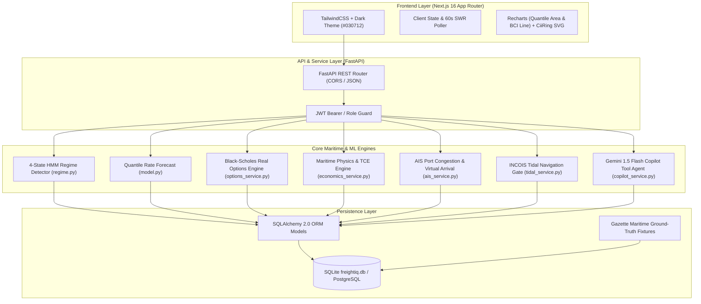
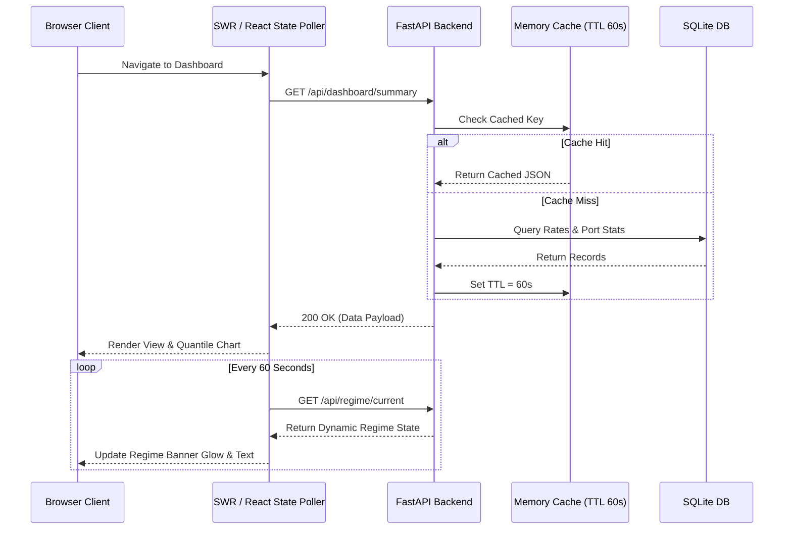

# 🛠️ FreightIQ — Technical Requirements Document (TRD)
## Document Code: SPEC-TRD-002 | Version: 2.0 | SIH2026 Problem SIH26006
### Focus: Stack Architecture, Mathematical Formulations, APIs & Decision Blueprints

---

## 1. System Architecture Topology

FreightIQ follows a decoupled, service-oriented client-server architecture with an asynchronous REST API and offline fallback capabilities:

---

## 2. Technology Stack & Architectural Decision Records (ADR)

| Layer | Technology | Version | Architectural Rationale |
|---|---|---|---|
| **Web Framework** | Next.js (App Router) | `16.3.5` (Turbopack) | Server-side rendering (SSR), static site generation (SSG) for instant route caching, zero-layout-shift UI. |
| **UI Library** | React | `19.0.0` | React Server Components (RSC) and fast concurrent hydration. |
| **Styling** | TailwindCSS | `4.x` | Curated dark-mode palette (`#030712`), no runtime CSS overhead, glassmorphism utilities. |
| **Data Visualization**| Recharts | `2.15.x` | Native SVG rendering for quantile confidence bands, custom tooltips, and BCI time-series. |
| **Iconography** | Lucide-React | `0.4x` | Lightweight tree-shakeable SVG icon set for maritime, weather, and financial indicators. |
| **Backend API** | FastAPI | `0.115.x` | High-throughput asynchronous Python ASGI server; automatic OpenAPI/Swagger documentation; Pydantic v2 validation. |
| **ORM / Data Layer** | SQLAlchemy | `2.0.x` | Declarative mapping, database agnostic (seamless zero-code switch between SQLite dev and PostgreSQL prod). |
| **Database** | SQLite (Dev) / PostgreSQL (Prod) | `3.45+` / `16+` | Zero-config standalone portability for hackathon offline demo; ACID compliance for contract ledgers. |
| **Machine Learning** | LightGBM / Scikit-Learn / SciPy | Latest | Fast tabular regression, probabilistic quantile loss minimization ($L_{0.10}, L_{0.50}, L_{0.90}$). |
| **Regime Modeling** | `hmmlearn` + Fallback Heuristics | `0.3.x` | 4-state Gaussian Hidden Markov Model with automated fallback to rolling volatility/trend clustering if library is missing. |
| **LLM & Copilot** | Google Gemini 1.5 Flash | Python SDK | Low-latency (sub-second) reasoning, 1M token context, native JSON tool-calling capabilities. |

---

## 3. Core Algorithmic Formulations

### 3.1 Black-Scholes Real Options Market Entry Timing
Chartering contracts are evaluated as an **American Call Option on Freight**:
$$\text{Option Value } C = S \cdot N(d_1) - K \cdot e^{-rT} N(d_2)$$
Where:
* $S = \text{Current Spot Freight Rate (USD/MT)}$
* $K = \text{Forward Target / Strike Rate from Forecast Model (USD/MT)}$
* $r = \text{Risk-free rate (SOFR 1-year benchmark, } \approx 4.5\%)$
* $T = \text{Time to laycan window (days } / 365)$
* $\sigma = \text{Annualized freight volatility calculated over 52-week rolling window}$
$$d_1 = \frac{\ln(S/K) + (r + \frac{\sigma^2}{2})T}{\sigma \sqrt{T}}, \quad d_2 = d_1 - \sigma \sqrt{T}$$

**Decision Rules:**
* If $S \le K \cdot (1 - \text{margin})$ AND Drift is Positive $\rightarrow$ `CHARTER_NOW` (Early exercise).
* If $S > K$ AND $\text{Option Value} > \text{Waiting Cost (Storage/Demurrage)}$ $\rightarrow$ `WAIT_X_DAYS`.

### 3.2 4-State Hidden Markov Model (HMM) Market Regime
Given observable feature vector $O_t = [\Delta BCI_t, \text{Bunker}_t, \text{Congestion}_t, \text{Availability}_t]$:
* Hidden States: $S = \{ \text{BEAR\_DISTRESS}, \text{NEUTRAL}, \text{SEASONAL\_LIFT}, \text{SUPERCYCLE\_BULL} \}$
* Transition Matrix: $A_{ij} = P(q_{t+1} = S_j \mid q_t = S_i)$
* Emission Probabilities: $B_j(O_t) = \mathcal{N}(O_t \mid \mu_j, \Sigma_j)$
* Forward-Backward Algorithm dynamically computes current state belief $P(q_t = S_k \mid O_{1:t})$ and 30-day forecast trajectory.

### 3.3 Admiralty Coefficient & Virtual Arrival Slow-Steaming Physics
Fuel consumption is governed by naval architecture power curves:
$$\frac{P_1}{P_2} = \left(\frac{v_1}{v_2}\right)^3, \quad \text{Daily Fuel Consumption (MT)} \propto v^3 \cdot \Delta^{2/3}$$
* When destination port queue delay $> 48\text{ hours}$, speed is reduced from service speed $v_1$ (14.0 knots) to eco-speed $v_2$ (11.5 knots).
* **Bunker Fuel Saved (MT):**
$$\Delta F = F_{\text{service}} \cdot \left[1 - \left(\frac{v_2}{v_1}\right)^3 \cdot \frac{D/v_2}{D/v_1}\right] = F_{\text{service}} \cdot \left[1 - \left(\frac{v_2}{v_1}\right)^2\right]$$
* **Net Financial Benefit:**
$$\text{Net Savings} = (\Delta F \cdot P_{\text{VLSFO}}) - \text{In-transit inventory holding cost} + \text{Avoided demurrage}$$

### 3.4 IMO Carbon Intensity Indicator (CII) & EU ETS
Annual Operational Carbon Intensity Indicator (AER formula):
$$\text{AER} = \frac{\sum_i (\text{Fuel}_i \times C_{F,i})}{\text{Capacity (DWT)} \times \text{Distance (NM)}} \quad \left[\frac{\text{g CO}_2}{\text{DWT} \cdot \text{NM}}\right]$$
* Emission factors: VLSFO = $3.114\text{ g CO}_2/\text{g fuel}$, LSMGO = $3.206\text{ g CO}_2/\text{g fuel}$.
* Rating Boundaries ($A, B, C, D, E$) determined via IMO Resolution MEPC.354(78).
* EU ETS Scope 3 Cost:
$$\text{Carbon Cost (USD)} = M_{\text{CO2 (MT)}} \times \text{EUA Price (EUR/MT)} \times \text{EUR/USD Rate}$$

---

## 4. Internal API Endpoints Specification

All endpoints are hosted under `http://localhost:8000` with standard JSON serialization:

### Core Endpoints

1. `GET /health`
   * Response: `{"status": "ok", "app": "FreightIQ", "version": "2.0.0"}`
2. `GET /api/dashboard/summary`
   * Response: Active rate snapshots, Baltic indices (BDI, BCI, BPI), market signals, port status.
3. `POST /api/forecast/predict`
   * Body: `{origin, destination, vessel_class, commodity, cargo_mt, horizon_days}`
   * Response: `predicted_rate_usd_per_mt`, `p10`, `p50`, `p90`, `confidence_pct`, `trend`, `tce_estimate`.
4. `POST /api/economics/calculate`
   * Body: `{origin, destination, vessel_class, commodity, cargo_mt, bunker_price_usd_per_mt, port_days_origin, port_days_dest, freight_rate_usd_per_mt?}`
   * Response: Full voyage P&L, sea days, distance NM, bunker cost, port dues, canal tolls, gross profit, margin %, breakeven rate.
5. `POST /api/scenarios/idle-analysis`
   * Body: `{origin, destination, vessel_class, commodity, cargo_mt, waiting_days, demurrage_rate_usd_day, bunker_price_usd_per_mt, slow_steaming_knots}`
   * Response: `total_congestion_exposure_usd`, `slow_steaming_bunker_savings_usd`, `strategy`, `diversion_candidates`.
6. `POST /api/vessels/recommend`
   * Body: `{cargo_mt, commodity, origin, destination, max_draft?}`
   * Response: Ranked vessel classes (Panamax, Supramax, Capesize) with suitability scores.
7. `POST /api/ports/check`
   * Body: `{port_name, vessel_class, draft_m, loa_m, beam_m, parcel_mt}`
   * Response: `compatible: bool`, `reasons: []`, `max_draft`, `max_dwt`, `tide_window`.
8. `POST /api/market-entry/signal`
   * Body: `{origin, destination, vessel_class, target_laycan_days}`
   * Response: `signal` (`BUY_NOW` / `WAIT`), `confidence_pct`, `option_value_usd`, `recommended_strike`.
9. `POST /api/risk/score`
   * Body: `{origin, destination, vessel_class, season, route_waypoints?}`
   * Response: `risk_score` (0–100), `risk_level`, `sub_scores: {weather, geopolitical, bunker, congestion}`.
10. `POST /api/contracts/compare`
    * Body: `{volume_mt, horizon_months, origin, destination}`
    * Response: Cost and risk comparison for Spot vs. COA vs. Time Charter.
11. `GET /api/ports/congestion?port={name}`
    * Response: `port`, `congestion_score`, `queue_count`, `avg_waiting_days`, `green_hub`, `active_vessels`.
12. `POST /api/copilot/query`
    * Body: `{question: string, session_id?: string}`
    * Response: `response: string`, `tools_called: []`, `citations: []`.

---

## 5. Caching, Concurrency & Polling Architecture

---

## 6. Offline Demonstration Blueprint

To guarantee fail-safe execution during evaluation when WiFi or proxy restrictions are present:
1. **Frontend Assets:** All fonts (Inter), icons (Lucide-React), and libraries are bundled locally; zero external CDN dependencies.
2. **Backend Services:** `freightiq.db` is pre-seeded with 24,700 weekly freight observations and 50 maritime corridor profiles.
3. **Automated Launch Script (`START_OFFLINE_DEMO.ps1`):**
   * Validates Python and Node.js runtimes.
   * Spins up FastAPI on `http://localhost:8000`.
   * Verifies health endpoint.
   * Spins up Next.js on `http://localhost:3000`.
   * Automatically opens Google Chrome to the command center.
