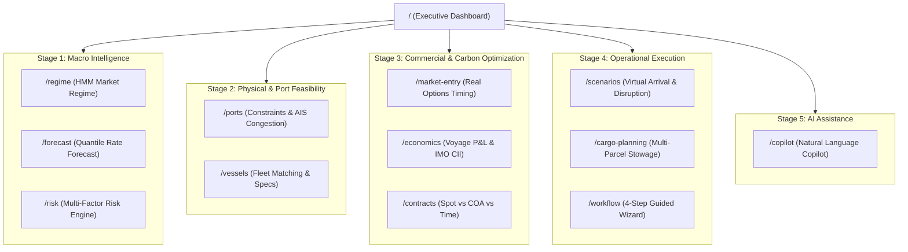

# 🧭 FreightIQ — App Flow & User Journey Map
## Document Code: SPEC-FLW-003 | Version: 2.0 | SIH2026 Problem SIH26006
### Focus: Application Navigation Tree, Button Triggers, Page Transitions & Operational Journeys

---

## 1. Global Navigation Architecture

FreightIQ organizes 16 specialized routes into a unified 5-stage chartering lifecycle:



---

## 2. Page-by-Page Interactive Triggers & Transition Map

### 2.1 Route: `/` (Executive Command Dashboard)
* **Default State:** Loads 4 active route cards (Australia ➔ Thoothukudi, Australia ➔ Chennai, Australia ➔ Paradip, Indonesia ➔ Chennai) with live rate snapshots, market regime banner, 4 port congestion cards, and quantile area forecast chart.
* **Interactive Triggers:**
  1. **Click Route Card:** Highlights selected corridor; triggers parallel re-fetch of historical actuals and P10/P50/P90 forecast points; updates main chart.
  2. **Click Regime Banner:** Navigates directly to `/regime` with current state pre-selected.
  3. **Click Port Congestion Card (e.g., Thoothukudi):** Navigates to `/ports?port=thoothukudi` with active berth queues loaded.
  4. **Click Tidal Safe Window:** Navigates to `/ports` and scrolls to the tidal harmonic curve.
  5. **Click "Ask Copilot" Button:** Navigates to `/copilot` with route context pre-filled in the prompt bar.

---

### 2.2 Route: `/regime` (HMM Market Regime Classifier)
* **Goal:** Diagnose macro market cycles and transition probabilities.
* **Interactive Triggers:**
  1. **Timeframe Selector (30d / 90d / 180d / 1y):** Recharts recalculates the BCI time-series with colored background zone bands (Red = Bear, Blue = Neutral, Green = Seasonal Lift, Amber = Supercycle Bull).
  2. **Hover Transition Matrix Cell:** Highlights probability of moving from State $i$ to State $j$ over 30 days.
  3. **Click "Apply Regime Strategy":** Navigates to `/market-entry` passing regime recommendation as a parameter.

---

### 2.3 Route: `/forecast` (Quantile Rate Forecasting)
* **Goal:** Model probabilistic freight rates across international and coastal corridors.
* **Interactive Triggers:**
  1. **Select Origin, Destination, Vessel Class, Commodity:** Filters available historical data.
  2. **Horizon Slider (7d, 14d, 30d, 60d):** Adjusts forecast time window.
  3. **Click "Generate Forecast":** Calls `POST /api/forecast/predict`; renders P10, P50, and P90 confidence envelopes with historical backtest accuracy.
  4. **Click "Export Rate Curve (CSV)":** Downloads timestamped CSV containing quantile predictions.

---

### 2.4 Route: `/market-entry` (Black-Scholes Real Options Timing)
* **Goal:** Decide whether to fix freight today or wait.
* **Interactive Triggers:**
  1. **Inputs:** Target Laycan Window (days), Internal Budget Ceiling ($/MT), Volatility Override.
  2. **Click "Evaluate Market Entry":** Calls `POST /api/market-entry/signal`; computes American Call Option value.
  3. **Output Display:** Displays large recommendation badge (`CHARTER_NOW` in emerald or `WAIT_X_DAYS` in blue) with calculated option value in USD.
  4. **Click "Proceed to Vessel Charter":** Navigates to `/ports` with recommended fixing window.

---

### 2.5 Route: `/ports` (Physical Constraints & AIS Congestion)
* **Goal:** Verify draft/LOA compatibility, inspect live queues, and check tidal windows.
* **Interactive Triggers:**
  1. **Port Dropdown (Thoothukudi, Chennai, Kamarajar, Paradip, Haldia, etc.):** Loads port specifications, max draft, berth layouts, and Green Hydrogen Hub status.
  2. **Vessel Specs Input (Draft, LOA, Beam, Parcel MT):** Triggers instant client-side draft clearance check.
  3. **Click "Check Berth Compatibility":** Calls `POST /api/ports/check`; displays Green "FEASIBLE" or Red "INCOMPATIBLE" with engineering clearance margin.
  4. **Inspect Gazette Queue Table:** Displays active vessels in queue (e.g., `MV Vishva Vijay` at VOCPA NCB-I) with cargo and turnaround days.
  5. **Tidal Window Chart:** Shows 24-hour high/low water tide heights; highlights safe navigation gates for deep-draft vessels.

---

### 2.6 Route: `/economics` (Voyage Economics & IMO CII Carbon Ring)
* **Goal:** Calculate full voyage P&L, daily TCE, and carbon surcharges.
* **Interactive Triggers:**
  1. **Inputs:** Origin, Destination, Vessel Class, Commodity, Cargo MT, Bunker Price ($/MT), Port Days.
  2. **Click "Calculate P&L":** Calls `POST /api/economics/calculate`.
  3. **Dynamic Results:**
     - 4 StatCards: Freight Revenue, Voyage Expenses, Gross Operating Profit, TCE ($/day).
     - Horizontal Bar Chart: Breakdown of Bunker, Port Dues, Canal Tolls, and OPEX.
     - Full Audited Accounting P&L Table.
     - **IMO Carbon Intensity Card:** Renders animated SVG circular `CiiRing` showing letter grade (A–E) and EU ETS cost exposure ($/MT CO2).

---

### 2.7 Route: `/scenarios` (Virtual Arrival & Gazette Disruption Simulator)
* **Goal:** Model congestion demurrage vs. slow-steaming savings with real evidence.
* **Interactive Triggers:**
  1. **Select Pre-Built Scenario:**
     - *Scenario 1:* Australia ➔ Thoothukudi VOCPA (Panamax Coal Import).
     - *Scenario 2:* Indonesia ➔ Chennai Jawahar Dock (Supramax Pig Iron).
     - *Scenario 3:* Australia ➔ Paradip Congestion Diversion to Gangavaram.
     - *Scenario 4:* Red Sea / Suez Canal Blockade (Cape Detour).
  2. **Click "Run Scenario Simulation":** Calls `POST /api/scenarios/idle-analysis`.
  3. **Results View:** Shows Demurrage Exposure vs. Virtual Arrival Slow-Steaming Savings ($120,155 saved), recommended diversion ports, and Gazette Source Evidence citations table.

---

### 2.8 Route: `/contracts` (Contract Structure Optimizer)
* **Goal:** Compare Spot procurement vs. COA vs. Time Charter.
* **Interactive Triggers:**
  1. **Annual Cargo Volume (MT) & Duration Slider:** Adjusts exposure parameters.
  2. **Click "Compare Contract Structures":** Calls `POST /api/contracts/compare`; displays 3-column comparative matrix with expected cost, volatility risk, and recommended allocation.

---

### 2.9 Route: `/copilot` (AI Chartering Copilot)
* **Goal:** Natural language decision support with transparent tool execution.
* **Interactive Triggers:**
  1. **Preset Prompt Chips:** Clicking any chip ("Analyze VOCPA draft for 75k MT coal", "Compare spot vs COA for Australia-Chennai", "Estimate slow steaming savings for Paradip") populates the input bar and triggers generation.
  2. **User Input:** Enter text query; displays typing indicator.
  3. **Tool-Call Display:** Renders visual badges for every backend tool invoked (`search_rates`, `check_port_constraints`, etc.).
  4. **Response Card:** Markdown rendered text with bulleted recommendations, risk warnings, and clickable citations.

---

### 2.10 Route: `/workflow` (4-Step Guided Chartering Wizard)
* **Goal:** Step-by-step guided workflow for junior chartering officers.
* **Flow:**
  * **Step 1 (Market Timing):** Select corridor $\rightarrow$ View HMM Regime & Option Signal $\rightarrow$ Click "Lock Timing".
  * **Step 2 (Port & Vessel Match):** Specify cargo $\rightarrow$ Validate Draft/LOA $\rightarrow$ Click "Confirm Vessel".
  * **Step 3 (Voyage Economics):** Set bunker price $\rightarrow$ Review P&L and CII rating $\rightarrow$ Click "Approve Financials".
  * **Step 4 (Execution Summary):** Export complete chartering requisition brief as PDF/print.

---

## 3. End-to-End User Journey Walkthroughs

### Journey 1: Coking Coal Import to Thoothukudi (VOCPA)
```
[Dashboard] 
   │ User clicks "AUS ➔ Thoothukudi" card
   ▼
[Regime Banner] 
   │ Confirms "SEASONAL_LIFT (74% Conf)" -> Early booking favored
   ▼
[Market Entry Page] 
   │ Real options engine calculates 12-day wait option value ($120k)
   ▼
[Port Feasibility Page] 
   │ Checks Thoothukudi VOCPA North Cargo Berth (NCB-I)
   │ Validates 74,510 MT Panamax draft (14.1m < 14.2m limit -> FEASIBLE)
   │ Reviews active queue: MV Vishva Vijay discharging
   ▼
[Economics Page] 
   │ Calculates voyage TCE ($19,950/day) & Margin (26.4%)
   │ Reviews CII Rating B on circular SVG ring
   ▼
[Copilot / Export] 
   │ Generates executive chartering memo with single-click verification
```

### Journey 2: Congestion Mitigation & Virtual Arrival
```
[Dashboard Alert] 
   │ Paradip port flagged with 82/100 congestion (6.5 days waiting queue)
   ▼
[Scenarios Simulator] 
   │ User selects "Australia to Paradip Congestion"
   │ System evaluates:
   │   - Full-speed arrival: 6.5 days anchorage = $156,000 demurrage
   │   - Virtual Arrival (11.5 kts): Burns 185 MT less VLSFO = $120,155 saved
   │   - Diversion alternative: Divert to Gangavaram (Zero queue, 18m draft)
   ▼
[Action Decision] 
   │ Issues Virtual Arrival speed reduction notice to shipowner
```
