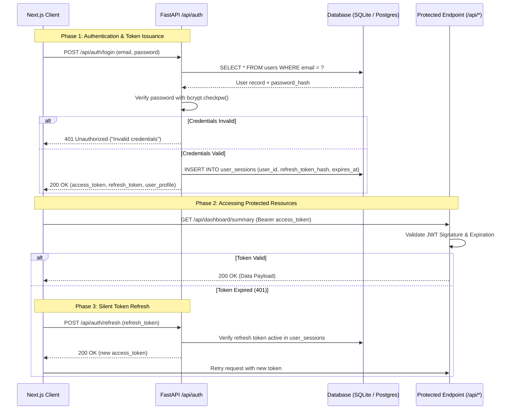
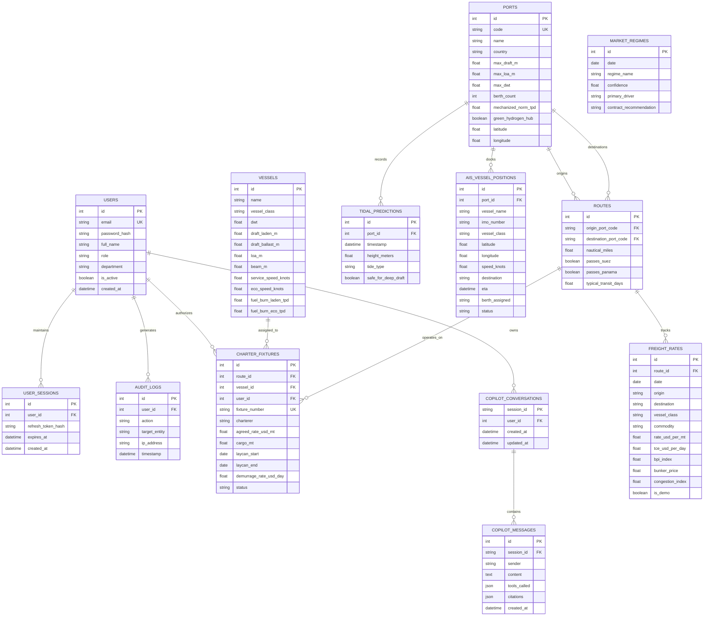

# 🗄️ FreightIQ — Backend Schema & Authentication Flow
## Document Code: SPEC-DAT-005 | Version: 2.0 | SIH2026 Problem SIH26006
### Focus: Relational Database Schema, ER Diagrams, JWT Auth & RBAC Security

---

## 1. Authentication & Security Architecture

### 1.1 Token Architecture & Cryptographic Standards
FreightIQ implements a stateless **JSON Web Token (JWT)** session architecture designed for enterprise single sign-on (SSO) and hackathon security compliance:
* **Access Tokens:** Short-lived (15 minutes), signed with HMAC-SHA256 (`HS256`) or asymmetric `RS256`. Contains `user_id`, `role`, `department`, and `scope` claims.
* **Refresh Tokens:** Long-lived (7 days), stored in an HTTP-only secure cookie or persisted in the `user_sessions` table with cryptographic hashing (`SHA-256`) to enable immediate revocation.
* **Password Hashing:** `Argon2id` or `bcrypt` (12 rounds) with unique cryptographic salt per user.

### 1.2 Role-Based Access Control (RBAC) Matrix

| Endpoint / Action | `ADMIN` | `CHARTERING_LEAD` | `OPERATIONS_OFFICER` | `AUDITOR_VIEWER` |
|---|:---:|:---:|:---:|:---:|
| View Dashboard & Quantile Forecasts | ✅ | ✅ | ✅ | ✅ |
| Run Port Constraints & Tidal Checks | ✅ | ✅ | ✅ | ✅ |
| Generate Voyage P&L & Carbon Accounting | ✅ | ✅ | ✅ | ✅ |
| Query AI Chartering Copilot | ✅ | ✅ | ✅ | ❌ |
| Create / Lock Formal Charter Fixture | ✅ | ✅ | ❌ | ❌ |
| Override Synthetic Rates / Re-Seed Database | ✅ | ❌ | ❌ | ❌ |
| View System Audit Logs | ✅ | ❌ | ❌ | ✅ |

### 1.3 Complete Authentication Sequence Diagram



---

## 2. Complete Entity-Relationship (ER) Diagram



---

## 3. Database Table Definitions & Schema Specifications

### Table 1: `users`
Stores user authentication records and role permissions.
* `id` (INTEGER, Primary Key, Auto-increment)
* `email` (VARCHAR(128), Unique, Indexed, NOT NULL)
* `password_hash` (VARCHAR(255), NOT NULL)
* `full_name` (VARCHAR(128), NOT NULL)
* `role` (VARCHAR(32), Default: `'CHARTERING_LEAD'`) — `ADMIN`, `CHARTERING_LEAD`, `OPERATIONS_OFFICER`, `AUDITOR_VIEWER`
* `department` (VARCHAR(64), Default: `'SAIL Shipping Cell'`)
* `is_active` (BOOLEAN, Default: `true`)
* `created_at` (DATETIME, Default: `CURRENT_TIMESTAMP`)

---

### Table 2: `freight_rates`
Historical and synthetic weekly spot freight observations (24,700 rows).
* `id` (INTEGER, Primary Key, Auto-increment)
* `date` (DATE, Indexed, NOT NULL)
* `origin` (VARCHAR(64), Indexed, NOT NULL) — e.g., `'Australia'`, `'Indonesia'`, `'United States'`
* `destination` (VARCHAR(64), Indexed, NOT NULL) — e.g., `'Thoothukudi'`, `'Chennai'`, `'Paradip'`
* `vessel_class` (VARCHAR(32), Indexed, NOT NULL) — `'Panamax'`, `'Supramax'`, `'Capesize'`
* `commodity` (VARCHAR(64), NOT NULL) — `'Coal'`, `'Iron Ore'`, `'Pig Iron'`
* `rate_usd_per_mt` (FLOAT, NOT NULL) — Base freight rate
* `tce_usd_per_day` (FLOAT, NOT NULL) — Daily Time Charter Equivalent
* `bpi_index` (FLOAT) — Associated Baltic Panamax Index value
* `bunker_price` (FLOAT, NOT NULL) — VLSFO price USD/MT
* `congestion_index` (FLOAT, Default: `0.0`) — Port congestion index 0.0–1.0
* `is_demo` (BOOLEAN, Default: `true`) — Audit label for synthetic/demo isolation

---

### Table 3: `ports`
Port physical restrictions, berths, and specialized facilities.
* `id` (INTEGER, Primary Key, Auto-increment)
* `code` (VARCHAR(16), Unique, Indexed, NOT NULL) — e.g., `'IN_TUT'` (VOCPA), `'IN_MAA'` (Chennai)
* `name` (VARCHAR(64), NOT NULL)
* `max_draft_m` (FLOAT, NOT NULL) — 14.2m for Thoothukudi, 15.5m for Chennai, 8.5m for Haldia
* `max_loa_m` (FLOAT, NOT NULL)
* `max_dwt` (FLOAT, NOT NULL) — 95,000 for VOCPA, 150,000 for Chennai, 180,000 for Kamarajar
* `berth_count` (INTEGER, NOT NULL)
* `mechanized_norm_tpd` (FLOAT, Default: `15000.0`) — Discharge norm in MT/day
* `green_hydrogen_hub` (BOOLEAN, Default: `false`) — `true` for Thoothukudi and Paradip
* `latitude` (FLOAT, NOT NULL)
* `longitude` (FLOAT, NOT NULL)

---

### Table 4: `vessels`
Standard dry-bulk vessel class specifications and consumption curves.
* `id` (INTEGER, Primary Key, Auto-increment)
* `name` (VARCHAR(64), NOT NULL) — e.g., `'MV Vishva Vijay'`, `'MV Supra Monarch'`
* `vessel_class` (VARCHAR(32), NOT NULL) — `'Handysize'`, `'Supramax'`, `'Panamax'`, `'Capesize'`
* `dwt` (FLOAT, NOT NULL)
* `draft_laden_m` (FLOAT, NOT NULL)
* `loa_m` (FLOAT, NOT NULL)
* `beam_m` (FLOAT, NOT NULL)
* `service_speed_knots` (FLOAT, Default: `14.0`)
* `eco_speed_knots` (FLOAT, Default: `11.5`)
* `fuel_burn_laden_tpd` (FLOAT, NOT NULL) — Tons/day VLSFO at service speed
* `fuel_burn_eco_tpd` (FLOAT, NOT NULL) — Tons/day VLSFO at eco speed

---

### Table 5: `ais_vessel_positions`
Live AIS telemetry queue data extracted from maritime gazettes.
* `id` (INTEGER, Primary Key, Auto-increment)
* `port_id` (INTEGER, Foreign Key to `ports.id`, NOT NULL)
* `vessel_name` (VARCHAR(64), NOT NULL)
* `imo_number` (VARCHAR(16), NOT NULL)
* `vessel_class` (VARCHAR(32), NOT NULL)
* `latitude` (FLOAT, NOT NULL)
* `longitude` (FLOAT, NOT NULL)
* `speed_knots` (FLOAT, NOT NULL)
* `destination` (VARCHAR(64), NOT NULL)
* `eta` (DATETIME)
* `berth_assigned` (VARCHAR(32)) — e.g., `'NCB-I'`, `'JD-2'`, `'CB1'`
* `status` (VARCHAR(32)) — `'DISCHARGING'`, `'IN_QUEUE'`, `'AT_ANCHOR'`

---

### Table 6: `market_regimes`
HMM regime historical classification and 30-day transition tracking.
* `id` (INTEGER, Primary Key, Auto-increment)
* `date` (DATE, NOT NULL)
* `regime_name` (VARCHAR(32), NOT NULL) — `'BEAR_DISTRESS'`, `'NEUTRAL'`, `'SEASONAL_LIFT'`, `'SUPERCYCLE_BULL'`
* `confidence` (FLOAT, NOT NULL) — 0.0 to 1.0
* `primary_driver` (VARCHAR(128), NOT NULL)
* `contract_recommendation` (VARCHAR(128), NOT NULL)

---

## 4. Indexing & Query Optimization Strategy

To ensure zero latency on complex dashboard loads:
1. **Composite Index on `freight_rates`:**
   ```sql
   CREATE INDEX idx_rates_composite ON freight_rates(origin, destination, vessel_class, date DESC);
   ```
2. **Date Index on `market_regimes`:**
   ```sql
   CREATE INDEX idx_regime_date ON market_regimes(date DESC);
   ```
3. **Port Foreign Key on `ais_vessel_positions`:**
   ```sql
   CREATE INDEX idx_ais_port ON ais_vessel_positions(port_id, status);
   ```
