# 🏗️ FreightIQ — Step-by-Step Implementation Plan
## Document Code: SPEC-IMP-006 | Version: 2.0 | SIH2026 Problem SIH26006
### Focus: Sequential AI Agent Build Roadmap, Phased Execution & Automated Verification

---

## 1. Build Sequence & Dependency Graph

To prevent circular dependencies and blocking errors, an AI Agent or developer must execute the build in **6 strict sequential phases**:

```mermaid
graph TD
    P1["Phase 1: Environment & Runtime Scaffolding"] --> P2["Phase 2: Database Models & Gazette Seeding"]
    P2 --> P3["Phase 3: Maritime Physics, Math & ML Engines"]
    P3 --> P4["Phase 4: FastAPI REST Endpoints & Tests"]
    P4 --> P5["Phase 5: Frontend Design System & 16 Routes"]
    P5 --> P6["Phase 6: Copilot Tool-Calling & Offline Hardening"]

    style P1 fill:#1e293b,stroke:#06b6d4,stroke-width:2px
    style P2 fill:#1e293b,stroke:#06b6d4,stroke-width:2px
    style P3 fill:#1e293b,stroke:#06b6d4,stroke-width:2px
    style P4 fill:#1e293b,stroke:#10b981,stroke-width:2px
    style P5 fill:#1e293b,stroke:#10b981,stroke-width:2px
    style P6 fill:#1e293b,stroke:#f59e0b,stroke-width:2px
```



---

## 2. Phase-by-Phase Build Instructions

### Phase 1: Environment & Scaffolding
* **Objective:** Establish isolated runtimes for Python 3.11+ backend and Node.js 20+ frontend.
* **Step 1.1:** Scaffold backend root directory `backend/` with `requirements.txt` (`fastapi`, `uvicorn`, `pydantic`, `sqlalchemy`, `scipy`, `numpy`, `pandas`, `scikit-learn`, `lightgbm`, `httpx`).
* **Step 1.2:** Initialize Next.js 16 app with Turbopack and TailwindCSS in `frontend/`.
* **Step 1.3:** Configure `.env` and `.env.local` pointing frontend `NEXT_PUBLIC_API_URL` to `http://localhost:8000`.

---

### Phase 2: Database Models & Ground-Truth Maritime Seeding
* **Objective:** Model physical dry-bulk logistics and populate with official gazette data.
* **Step 2.1:** Create SQLAlchemy 2.0 models in `backend/app/models/__init__.py`:
  - `FreightRate`, `Port`, `Vessel`, `Route`, `AisVesselPosition`, `MarketRegime`, `CharterFixture`.
* **Step 2.2:** Build seeder in `backend/app/seed/`:
  - Embed 17 ports (specifically Thoothukudi VOCPA [14.2m draft], Chennai [15.5m draft], Kamarajar [16.0m draft], Haldia [8.5m draft]).
  - Embed official fixtures from *Exim India Shipping Times* (Sept 11, 2026) and *Global Timex* (Sept 18, 2026) including `MV Vishva Vijay` (74,510 MT coal at VOCPA NCB-I) and `MV Supra Monarch` (52,500 MT pig iron at Chennai JD-2).
  - Generate 24,700 weekly historical synthetic rates across 50 international and domestic coastal routes.
* **Verification:** Run `python seed.py` $\rightarrow$ verify database file `freightiq.db` is populated.

---

### Phase 3: Maritime Physics, Financial Math & ML Engines
* **Objective:** Implement core algorithmic decision engines without UI dependencies.
* **Step 3.1 (HMM Classifier):** Write `backend/app/ml/regime.py`. Implement 4-state HMM regime detector with automatic rolling statistical fallback if `hmmlearn` is absent.
* **Step 3.2 (Quantile Forecaster):** Write `backend/app/ml/model.py`. Implement LightGBM quantile inference returning P10, P50, and P90 rates.
* **Step 3.3 (Black-Scholes Options):** Write `backend/app/services/options_service.py`. Implement American call option formula on freight volatility to generate `CHARTER_NOW` vs. `WAIT` signals.
* **Step 3.4 (Voyage Economics & TCE):** Write `backend/app/services/economics_service.py`. Implement Admiralty cubic speed formula, bunker consumption, port dues, and daily TCE returns.
* **Step 3.5 (AIS & Virtual Arrival):** Write `backend/app/services/ais_service.py`. Implement Virtual Arrival slow-steaming bunker savings ($P \propto v^3$) vs. demurrage avoidance.
* **Step 3.6 (Tidal Navigation Gate):** Write `backend/app/services/tidal_service.py`. Simulate INCOIS tidal harmonic curves and safe high-water windows for draft-restricted ports.

---

### Phase 4: FastAPI REST Endpoints & Automated Testing
* **Objective:** Expose clean REST endpoints with Pydantic v2 validation and verify 100% test pass.
* **Step 4.1:** Implement API routers in `backend/app/api/`:
  1. `GET /health`
  2. `GET /api/dashboard/summary`
  3. `POST /api/forecast/predict`
  4. `POST /api/economics/calculate`
  5. `POST /api/scenarios/idle-analysis`
  6. `POST /api/vessels/recommend`
  7. `POST /api/ports/check`
  8. `POST /api/market-entry/signal`
  9. `POST /api/risk/score`
  10. `POST /api/contracts/compare`
  11. `GET /api/ports/congestion`
  12. `POST /api/copilot/query`
* **Step 4.2:** Create comprehensive test script `backend/verify_all.py` validating all 12 endpoints.
* **Verification Command:**
  ```powershell
  cd backend
  python verify_all.py
  # Expected: ALL 12 CORE MODULE ENDPOINTS PASSED WITH 100% SUCCESS!
  ```

---

### Phase 5: Frontend Design System & 16-Route Assembly
* **Objective:** Assemble modern dark-mode UI with rich interactive charts and live polling.
* **Step 5.1:** Create design tokens and reusable UI components in `frontend/src/components/ui/`:
  - `Card`, `StatCard`, `PageHeader`, `Select`, `Input`, `Disclaimer`, `DemoBadge`.
  - Shimmer skeletons: `SkeletonCard`, `SkeletonChart`, `SkeletonList`, `SkeletonBanner`.
  - SVG Circular progress meter: `CiiRing.tsx`.
* **Step 5.2:** Build responsive navigation in `frontend/src/components/layout/Sidebar.tsx`:
  - Mobile hamburger toggle drawer with backdrop overlay.
  - Responsive main margin: `ml-0 lg:ml-64`.
* **Step 5.3:** Assemble Executive Dashboard in `frontend/src/app/page.tsx`:
  - Dynamic HMM regime banner with 60s background polling.
  - 4 Port congestion radar cards (Thoothukudi, Chennai, Paradip, Haldia).
  - Recharts quantile rate chart with P10/P50/P90 traces and confidence area shading.
  - Tidal calendar widget on right sidebar.
* **Step 5.4:** Assemble specialized analytical views:
  - `/ports`: Draft clearance checker, tidal window graph, live gazette queue.
  - `/economics`: Full voyage P&L, TCE breakdown, CarbonFootprintCard with `CiiRing`.
  - `/scenarios`: Virtual arrival savings calculator, evidence citations table.
  - `/regime`: 30-day BCI time-series chart with colored regime bands.
  - `/forecast`, `/market-entry`, `/vessels`, `/contracts`, `/risk`, `/workflow`.

---

### Phase 6: Copilot Tool-Calling & Offline Hardening
* **Objective:** Wire natural language AI copilot and ensure 100% offline hackathon readiness.
* **Step 6.1:** Connect `frontend/src/app/copilot/page.tsx` to `POST /api/copilot/query`. Render tool-call pills (`search_rates`, `check_port_constraints`) and evidence sources.
* **Step 6.2:** Create offline startup script `START_OFFLINE_DEMO.ps1` to launch full stack without internet.
* **Step 6.3:** Verify static compilation:
  ```powershell
  cd frontend
  npm run build
  # Expected: 16/16 routes compiled, 0 TypeScript errors
  ```

---

## 3. Ready-to-Use AI Agent Prompt Templates

When directing an AI agent (Claude, ChatGPT, or Antigravity) to build or extend any module, use these prompt templates:

### Prompt 1: Building an ML Decision Engine
```text
Task: Implement the Black-Scholes Real Options Engine in backend/app/services/options_service.py.
Inputs: spot_rate, strike_rate, volatility, time_to_laycan_days, risk_free_rate=0.045.
Requirements:
1. Compute d1, d2 using standard Black-Scholes formulation via scipy.stats.norm.
2. Return American call option value in USD.
3. Generate recommendation: 'CHARTER_NOW' if spot <= strike * 0.95 and drift > 0, else 'WAIT_X_DAYS'.
4. Calculate dollar option value of waiting.
5. Export Pydantic response model OptionsSignalResponse.
Verify with automated unit test.
```

### Prompt 2: Building an Interactive UI Component
```text
Task: Build an animated SVG circular progress ring CiiRing.tsx in frontend/src/components/ui/.
Props: grade: 'A' | 'B' | 'C' | 'D' | 'E', size?: number.
Requirements:
1. Circle radius = 38, strokeWidth = 8, viewBox="0 0 100 100".
2. Circumference = 2 * Math.PI * 38 ≈ 238.76.
3. Compute strokeDashoffset based on grade percentage:
   A = 100% (#22c55e), B = 80% (#86efac), C = 60% (#eab308), D = 40% (#f97316), E = 20% (#ef4444).
4. Add drop-shadow glow matching the tier color.
5. Center the letter grade in font-black text-2xl with subtle 'CII' label below.
6. Support smooth transition: stroke-dashoffset 1s ease-out.
```
