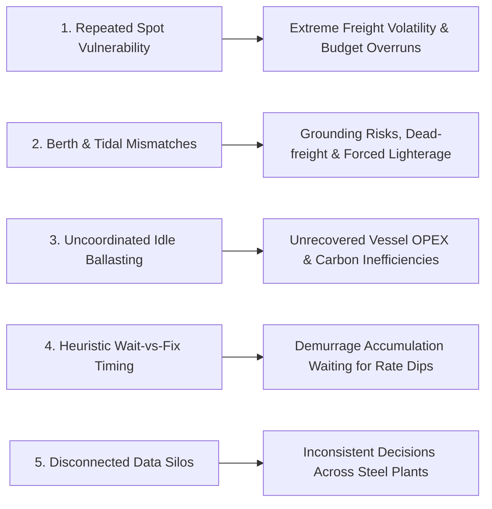
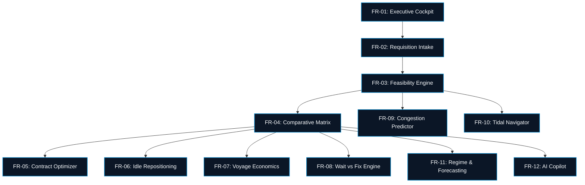

# 📄 Product Requirements Document (PRD)
## FREIGHT IQ — Maritime Freight Intelligence & Vessel Chartering Decision Support Platform

**Smart India Hackathon 2026 — Problem Statement SIH26006**  
**Sponsoring Client / Ministry**: Ministry of Steel / Steel Authority of India Limited (SAIL)  
**Theme**: Transportation, Logistics & Supply Chain Optimization  
**Document Version**: 2.0.0 (Production Reference)  
**Status**: APPROVED & IMPLEMENTED  

---

## 📑 Table of Contents

- [1. Document Overview & Metadata](#1-document-overview--metadata)
- [2. Executive Summary & Strategic Context](#2-executive-summary--strategic-context)
- [3. Problem Statement & Operational Pain Points](#3-problem-statement--operational-pain-points)
- [4. Product Vision, Goals & Success Metrics](#4-product-vision-goals--success-metrics)
- [5. User Personas & Journey Maps](#5-user-personas--journey-maps)
- [6. Functional Requirements (FR-01 to FR-12)](#6-functional-requirements-fr-01-to-fr-12)
  - [FR-01: Executive Operations Cockpit & Portfolio KPI Tracking](#fr-01-executive-operations-cockpit--portfolio-kpi-tracking)
  - [FR-02: Bulk Cargo Requisition Lifecycle Management](#fr-02-bulk-cargo-requisition-lifecycle-management)
  - [FR-03: Deterministic Vessel-Port Geometric Feasibility Engine](#fr-03-deterministic-vessel-port-geometric-feasibility-engine)
  - [FR-04: 3-Way Comparative Chartering Strategy Matrix](#fr-04-3-way-comparative-chartering-strategy-matrix)
  - [FR-05: Multi-Voyage Contract Strategy & Portfolio Coverage Optimizer](#fr-05-multi-voyage-contract-strategy--portfolio-coverage-optimizer)
  - [FR-06: Vessel Idle Exposure & Repositioning Intelligence](#fr-06-vessel-idle-exposure--repositioning-intelligence)
  - [FR-07: Voyage Economics, Speed Break-Even & Bunker Calculator](#fr-07-voyage-economics-speed-break-even--bunker-calculator)
  - [FR-08: Probabilistic Wait vs. Fix Timing Engine (Black-76 Real Options)](#fr-08-probabilistic-wait-vs-fix-timing-engine-black-76-real-options)
  - [FR-09: Port Congestion, Turnaround & Queue Time Predictor](#fr-09-port-congestion-turnaround--queue-time-predictor)
  - [FR-10: Dynamic Bathymetric Tidal Window & Under-Keel Clearance (UKC) Navigator](#fr-10-dynamic-bathymetric-tidal-window--under-keel-clearance-ukc-navigator)
  - [FR-11: Gaussian HMM Market Regime Detection & TFT Quantile Rate Forecasting](#fr-11-gaussian-hmm-market-regime-detection--tft-quantile-rate-forecasting)
  - [FR-12: Grounded AI Maritime Copilot (ReAct Agent + 12 Verifiable Tools)](#fr-12-grounded-ai-maritime-copilot-react-agent--12-verifiable-tools)
- [7. Non-Functional Requirements (NFR-01 to NFR-06)](#7-non-functional-requirements-nfr-01-to-nfr-06)
- [8. Data Architecture & Entity Relationship](#8-data-architecture--entity-relationship)
- [9. Data Provenance & Safety Boundaries](#9-data-provenance--safety-boundaries)
- [10. Implementation Phasing & Release Verification](#10-implementation-phasing--release-verification)

---

## 1. Document Overview & Metadata

| Attribute | Specification |
| :--- | :--- |
| **Product Name** | **FREIGHT IQ** |
| **Category** | Enterprise Maritime Decision Support System (DSS) |
| **Target Sector** | Dry Bulk Ocean Logistics, Coastal Shipping, Raw Material Procurement |
| **Target End-Users** | Central Procurement Directors, Chartering Officers, Voyage Analysts, Demurrage Teams |
| **Primary Trade Lanes** | Australia (Newcastle/Gladstone), South Africa (Richards Bay) $\rightarrow$ India East Coast (Paradip, Haldia, Visakhapatnam) |
| **Associated Repositories** | `https://github.com/MasterZ1311/FrieghtIQ.git` (Branch: `Dev1`) |

---

## 2. Executive Summary & Strategic Context

India's primary steel manufacturers (Steel Authority of India Limited, Rashtriya Ispat Nigam Limited, NMDC) consume over 70 million metric tons (MT) of imported coking coal, thermal coal, limestone, and manganese ore annually. Ocean freight constitutes **15% to 28% of the total landed cost** of raw materials.

Historically, bulk procurement has operated via fragmented, manual spot fixtures negotiated under tight laycan deadlines. In volatile freight markets, this single-voyage fixation exposes public sector enterprises to severe financial risks:
1. Multi-million dollar demurrage accruals at congested discharge terminals.
2. Forfeiture of volume discounts achievable through structured multi-voyage Contracts of Affreightment (COAs).
3. Massive deadhead ballast waste when vessels discharge on the Indian East Coast without integrated backhaul or coastal deployment.

**FREIGHT IQ** transforms maritime procurement from intuitive, reactive guesswork into an algorithmic, risk-controlled science. It combines deterministic physical ship-to-berth feasibility with probabilistic machine learning (Continuous Gaussian HMMs, Temporal Fusion Transformers, Black-76 real option financial theory) wrapped in an enterprise-grade web workstation.

---

## 3. Problem Statement & Operational Pain Points

### 3.1 Primary Problem (SIH26006)
> *"Development of an AI/ML-driven Decision Support Tool for Bulk Cargo Shipping & Coastal Fleet Optimization to reduce freight volatility, demurrage penalties, and deadhead voyages."*

### 3.2 Key Pain Points Identified

1. **Spot Freight Surges**: Fixing vessels voyage-by-voyage leaves procurement vulnerable to sudden market regime flips (`BULL` spikes caused by geopolitical shocks, weather disruptions, or canal bottlenecks).
2. **Physical Terminal Incompatibilities**: A vessel physically matching cargo capacity may violate terminal LOA, beam outreach of Continuous Ship Unloaders (CSUs), or maximum permissible draught at low tide (e.g., Haldia river bar constraints).
3. **Unrecovered Deadhead Legs**: Vessels completing discharge at Paradip or Vizag frequently ballast thousands of nautical miles back to Singapore or Australia without evaluating coastal domestic cargo opportunities.
4. **Intuitive vs. Mathematical Timing**: Charterers lack quantitative tools to evaluate whether waiting $N$ days for predicted freight softening compensates for accumulating port anchorage delay costs.

---

## 4. Product Vision, Goals & Success Metrics

### 4.1 Product Vision
To serve as the **definitive maritime operational operating system** for Indian sovereign and commercial bulk cargo logistics, establishing end-to-end transparency, mathematical rigor, and verifiable auditability across every chartering decision.

### 4.2 Key Success Metrics (Target KPIs)

| Metric | Baseline (Traditional Operations) | Target (With FREIGHT IQ) | Measurement Horizon |
| :--- | :--- | :--- | :--- |
| **Annualized Delivered Freight Cost** | Spot index benchmark $+ 8\%$ | Spot index $- 6\%$ to $- 14\%$ | 12 Months |
| **Demurrage Incurred ($/MT)** | $\$2.80 - \$4.20$ per MT delivered | $< \$1.40$ per MT delivered | Quarterly Review |
| **Deadhead Ballast Ratio** | 48% of total sailing distance | $< 32\%$ through coastal integration | Annualized Fleet Audit |
| **Chartering Decision Turnaround** | 3 to 5 Business Days | $< 15$ Minutes | Per Requisition |
| **Port Berth Suitability Errors** | 4.2% operational exceptions | $0.0\%$ (Strict deterministic filtering) | Continuous Telemetry |
| **Copilot Citation Accuracy** | N/A (Unassisted) | $100\%$ Verifiable Sourced Citations | Real-Time Query Audit |

---

## 5. User Personas & Journey Maps

### Persona 1: Rajesh Sharma — Executive Director (Raw Material Procurement)
- **Role**: High-level strategic oversight of annual coal and ore procurement programs.
- **Needs**: Macro-level portfolio visibility, forward budget certainty, carbon footprint metrics, and auditable governance dossiers.
- **Primary Pages**: `/dashboard`, `/reports`, `/optimization/contracts`.

### Persona 2: Capt. Vikram Nair — Senior Chartering Manager
- **Role**: Tactical execution of vessel fixtures, laycan negotiations, and strategy selection.
- **Needs**: Real-time 3-way comparative cost matrices, deterministic berth compatibility, Black-76 wait-vs-fix option scores, and market regime forecasts.
- **Primary Pages**: `/chartering/requests`, `/chartering/comparison`, `/chartering/decision/[id]`, `/intelligence/wait-fix`.

### Persona 3: Ananya Sen — Port Logistics & Demurrage Analyst
- **Role**: Monitoring vessel arrivals, queue lengths, tidal windows, and daily discharge rates.
- **Needs**: Real-time pre-berthing queue forecasts, dynamic tidal Under-Keel Clearance curves, and speed break-even calculators.
- **Primary Pages**: `/intelligence/congestion`, `/intelligence/tidal`, `/intelligence/ports`, `/optimization/speed`.

---

## 6. Functional Requirements (FR-01 to FR-12)

---

### FR-01: Executive Operations Cockpit & Portfolio KPI Tracking
- **URL**: `/dashboard`
- **Description**: The primary command workstation summarizing active procurement demands, fleet operational disposition, market indicators, and demurrage liabilities.
- **Requirements**:
  - Display 4 high-density metric summary cards:
    1. *Active Requisitions Volume* (Total MT currently in procurement pipeline).
    2. *Fleet Employment Status* (Real-time distribution across Employed, Available, Repositioning, Idle Risk).
    3. *Current Market Regime* (Active Gaussian HMM state: `BULL`, `BEAR`, `NEUTRAL`, `SEASONAL`).
    4. *Fleet Demurrage Liability* (Calculated USD exposure across East Coast anchorages).
  - Provide interactive filtering across commodities (`COKING_COAL`, `THERMAL_COAL`, `IRON_ORE`, `LIMESTONE`).
  - Provide immediate navigation shortcuts to urgent laycan fixtures requiring approval.

---

### FR-02: Bulk Cargo Requisition Lifecycle Management
- **URL**: `/chartering/requests`, `/chartering/new`
- **Description**: End-to-end requisition tracking from initial blast furnace demand requisition to contract execution.
- **Requirements**:
  - Requisition intake form validating: Cargo Grade, Quantity (MT), Tolerance ($\pm 5\%$ to $\pm 10\%$ MOLOO), Origin Port, Destination Port, Laycan Start/End dates.
  - Automatic classification of optimal vessel class (e.g., 75,000 MT $\rightarrow$ Panamax/Kamsarmax).
  - Status progression state machine: `DRAFT` $\rightarrow$ `ACTIVE` $\rightarrow$ `IN_EVALUATION` $\rightarrow$ `FIXED` $\rightarrow$ `COMPLETED` $\rightarrow$ `CANCELLED`.
  - Immutable changelog tracking modifications to parcel size or laycan dates.

---

### FR-03: Deterministic Vessel-Port Geometric Feasibility Engine
- **URL**: `/chartering/vessels`, `/optimization/vessel-port`
- **Description**: Multi-constraint screening evaluating whether a candidate vessel physically fits within the physical limits of load/discharge terminals.
- **Constraints Checked**:
  1. $\text{LOA}_{\text{vessel}} \le \text{Max LOA}_{\text{berth}}$
  2. $\text{Beam}_{\text{vessel}} \le \text{Max Beam}_{\text{berth}}$ (and CSU crane reach coverage)
  3. $\text{Laden Draft}_{\text{vessel}} \le \text{Charted Depth}_{\text{berth}} + \text{Tidal Allowance} - \text{UKC Margin}$
  4. $\text{Ballast Air Draft}_{\text{vessel}} \le \text{Max Air Draft}_{\text{conveyor}}$
  5. $\text{Vessel DWT} \le \text{Max Berth Displacement}$
- **Output States**:
  - `PASS`: Complies with all constraints with safety margin $> 0.5\text{m}$.
  - `CONDITIONAL`: Requires high-tide berthing window or lighterage.
  - `FAIL`: Violates one or more hard physical constraints.
  - `UNKNOWN`: Missing certified particulars (strictly prevents false positives).

---

### FR-04: 3-Way Comparative Chartering Strategy Matrix
- **URL**: `/chartering/comparison`, `/chartering/decision/[id]`
- **Description**: Multi-dimensional benchmark comparing three procurement modalities for any cargo demand:
  1. **Option A: Spot Market Single Fixture** (100% spot exposure, prompt flexibility).
  2. **Option B: Short-Term Multi-Voyage Program (90 Days / 2-3 Voyages)** (50% contracted).
  3. **Option C: Medium-Term Program COA (180 Days / 4+ Voyages)** (100% contracted).
- **Evaluation Dimensions**:
  - Risk-Adjusted Total Cost ($/MT delivered).
  - Spot Volatility Exposure (Uncertainty Penalty).
  - Operational Flexibility Score (0% to 100%).
  - Carbon Intensity Rating (IMO CII projection).
  - Modeled Break-Even Spot Rate ($/MT).
- **Deliverable**: Cryptographically signed, exportable Executive Decision Dossier.

---

### FR-05: Multi-Voyage Contract Strategy & Portfolio Coverage Optimizer
- **URL**: `/optimization/contracts`
- **Description**: Hybrid portfolio optimization simulating volume coverage distributions ($0\%$ to $100\%$).
- **Requirements**:
  - Interactive portfolio coverage slider allowing real-time scenario simulation.
  - Precise remainder preservation tracking:
    $$\text{Remainder MT} = \text{Total Cargo MT} \pmod{\text{Parcel Size MT}}$$
  - Monte Carlo stress-testing against Bear (-20%), Base (Current), and Bull (+25%) rate shocks.

---

### FR-06: Vessel Idle Exposure & Repositioning Intelligence
- **URL**: `/optimization/idle`
- **Description**: Fleet employment tracking module preventing deadhead ballast trips and minimizing unrecovered vessel OPEX.
- **Requirements**:
  - **9-State Employment State Machine**:
    `EMPLOYED`, `VOYAGE_COMPLETING`, `AVAILABLE`, `NEXT_EMPLOYMENT_PENDING`, `IDLE_RISK`, `IDLE`, `REPOSITIONING`, `ALTERNATIVE_EMPLOYMENT`, `UNKNOWN`.
  - **Deadhead Risk Scoring**:
    - `LOW`: Ballast leg $\le 1,500\text{ NM}$ with confirmed load port clearance.
    - `MEDIUM`: Ballast leg $1,500 - 3,000\text{ NM}$ with tight laycan buffer ($< 1.5\text{ days}$).
    - `HIGH`: Ballast leg $> 2,500\text{ NM}$ without confirmed subsequent employment.
  - Search engine scanning coastal cargo demands (e.g., domestic thermal coal / limestone) to monetize return legs.

---

### FR-07: Voyage Economics, Speed Break-Even & Bunker Calculator
- **URL**: `/optimization/speed`, `/optimization/voyage-cost`
- **Description**: Quantitative voyage financial calculator balancing fuel consumption against port delay penalties.
- **Requirements**:
  - Speed-consumption polynomial modeling daily fuel burn across Eco (11.5 kts), Normal (13.0 kts), and Full (14.5 kts).
  - Bunker economics integrating VLSFO and LSMGO benchmark prices.
  - Break-even speed solver determining whether speeding up to catch a laycan saves more in demurrage than it costs in incremental fuel burn.

---

### FR-08: Probabilistic Wait vs. Fix Timing Engine (Black-76 Real Options)
- **URL**: `/intelligence/wait-fix`
- **Description**: Timing engine answering whether charterers should fix immediately or postpone fixture by 3 to 7 days.
- **Formulation**:
  - Evaluates fixture postponement as a financial call option on ocean freight:
    $$\text{Net Advantage } \Delta W = V_{\text{Black-76 Option}} - (\text{Daily Demurrage Cost} \times \text{Waiting Days})$$
  - Output: Binary recommendation (`FIX_NOW` vs. `WAIT_RECOMMENDED`) with confidence percentage.

---

### FR-09: Port Congestion, Turnaround & Queue Time Predictor
- **URL**: `/intelligence/congestion`, `/intelligence/ports`, `/intelligence/ports/[id]`
- **Description**: Terminal congestion modeling predicting pre-berthing waiting times across major Indian discharge ports.
- **Requirements**:
  - Pre-berthing queue simulation for Paradip (CB-1, CB-2, IOBT), Haldia (Berths 4A/4B), and Vizag (EQ-1, WQ-1).
  - Continuous Ship Unloader (CSU) discharge rate tracking (Tons Per Day).
  - Congestion risk index: Low ($< 24\text{h}$), Medium ($24–72\text{h}$), High ($> 72\text{h}$).

---

### FR-10: Dynamic Bathymetric Tidal Window & Under-Keel Clearance (UKC) Navigator
- **URL**: `/intelligence/tidal`
- **Description**: High-resolution astronomical tidal curves for depth-restricted waterways (specifically Hooghly River & Haldia approaches).
- **Requirements**:
  - Semi-diurnal tidal height prediction for High Water (HW) and Low Water (LW).
  - Dynamic UKC safety computation factoring in vessel speed, shallow-water hydrodynamic squat, and swell allowance:
    $$\text{UKC}(t) = (h_{\text{charted}} + h_{\text{tide}}(t)) - (d_{\text{static}} + s_{\text{squat}}(v) + \delta_{\text{swell}})$$
  - Tidal navigation window rendering exact hours a laden vessel can cross bars safely.

---

### FR-11: Gaussian HMM Market Regime Detection & TFT Quantile Rate Forecasting
- **URL**: `/intelligence/regime`, `/intelligence/freight`
- **Description**: Macro shipping market classification and multi-horizon probabilistic freight rate projections.
- **Requirements**:
  - Continuous Gaussian Hidden Markov Model classifying market into `BULL`, `BEAR`, `NEUTRAL`, and `SEASONAL_SURGE`.
  - Temporal Fusion Transformer (TFT) multi-horizon forecast producing quantile boundaries:
    - $P10$: Bearish floor rate.
    - $P50$: Median expected spot rate.
    - $P90$: Bullish ceiling rate.
  - Historical backtesting metrics (MAE, RMSE, MAPE, Directional Accuracy).

---

### FR-12: Grounded AI Maritime Copilot (ReAct Agent + 12 Verifiable Tools)
- **URL**: `/ai/copilot`
- **Description**: Conversational decision intelligence assistant built using the ReAct (Reasoning + Acting) agent framework.
- **Requirements**:
  - Seamless access to 12 specialized analytical backend tools:
    1. `query_vessel_particulars`
    2. `query_port_berth_constraints`
    3. `evaluate_vessel_port_feasibility`
    4. `get_freight_rate_forecast`
    5. `get_market_regime_status`
    6. `analyze_wait_vs_fix`
    7. `analyze_contract_strategies`
    8. `calculate_voyage_economics`
    9. `get_port_congestion_status`
    10. `get_tidal_window_ukc`
    11. `get_vessel_employment_timeline`
    12. `generate_decision_dossier`
  - **Strict Grounding Guarantee**: Every factual claim must cite an exact database record ID or metric.
  - Zero tolerance for hallucination or unverified market speculation.

---

## 7. Non-Functional Requirements (NFR-01 to NFR-06)

### NFR-01: Performance & Latency
- **API Response Time**: Static data queries (ports, vessels, requisitions) must respond in $\le 100\text{ms}$.
- **Complex Optimization Runs**: Multi-variable portfolio optimization and Black-76 option pricing must complete in $\le 2.5\text{ seconds}$.
- **AI Copilot Streaming**: Time-to-First-Token (TTFT) for conversational streaming must be $\le 400\text{ms}$.

### NFR-02: Reliability & Availability
- **System Uptime**: 99.9% target availability during commercial trading hours.
- **Stateless Architecture**: FastAPI API gateway must be horizontally scalable behind standard load balancers.
- **Zero-Dependency Resilience**: Automatic fallback to local SQLite database when external PostgreSQL connections are unavailable.

### NFR-03: Data Provenance & Integrity
- **Missing Value Handling**: Incomplete ship or port particulars must evaluate to `UNKNOWN`; substitution of default dummy values that could risk vessel grounding is strictly prohibited.
- **Distance Traceability**: Haversine distance computations must be explicitly tagged `GEODESIC APPROXIMATION`. Only certified distance table queries may be labeled `NAUTICAL CHART`.

### NFR-04: Security & Governance
- **Access Control**: Role-Based Access Control (RBAC) separating Read-Only Analysts, Chartering Officers, and Executive Approvers.
- **Audit Ledger**: All strategic charter selections, risk waivers, and overrides must be cryptographically hashed and persisted in the `audit_logs` table.

### NFR-05: Usability & Human Factors
- **Visual Design**: High-density analytical interface adhering to the FreightIQ Design System (Naval Obsidian Dark Mode + Maritime Light Mode).
- **Tabular Numerals**: All monetary and volume quantities must render with tabular numeric fonts (`font-mono tabular-nums`) to prevent layout jitter.
- **Keyboard Ergonomics**: Global Command Palette accessible via `Cmd+K` / `Ctrl+K` across all views.

### NFR-06: Portability & Standards Compliance
- **Frontend Standards**: Fully responsive across resolutions from 1280x720 up to 4K displays.
- **Backend Standards**: Clean OpenAPI 3.0 (Swagger) specifications for all 15+ router namespaces.

---

## 8. Data Architecture & Entity Relationship

FREIGHT IQ implements an enterprise-grade normalized relational schema divided into 11 domains:

```mermaid
erDiagram
    PORTS ||--o{ BERTHS : houses
    PORTS ||--o{ PORT_CONSTRAINTS : binds
    BERTHS ||--o{ BERTH_CONSTRAINTS : enforces
    PORTS ||--o{ TIDAL_WINDOWS : records
    PORTS ||--o{ PORT_CONGESTIONS : monitors
    PORTS ||--o{ CARGO_REQUIREMENTS : origin_for
    PORTS ||--o{ CARGO_REQUIREMENTS : destination_for
    PORTS ||--o{ FREIGHT_ROUTES : origin_of
    PORTS ||--o{ FREIGHT_ROUTES : dest_of

    VESSELS ||--|| VESSEL_PARTICULARS : specifies
    VESSELS ||--o{ VESSEL_AVAILABILITIES : disposes
    VESSELS ||--o{ VESSEL_EMPLOYMENT_EVENTS : tracks
    VESSELS ||--o{ IDLE_SCENARIOS : exposes
    VESSELS ||--o{ REPOSITIONING_OPTIONS : evaluates

    CARGO_REQUIREMENTS ||--o{ VESSEL_MATCH_RUNS : triggers
    VESSEL_MATCH_RUNS ||--o{ VESSEL_MATCH_CANDIDATES : evaluates
    VESSELS ||--o{ VESSEL_MATCH_CANDIDATES : matched_in

    CARGO_REQUIREMENTS ||--o{ CONTRACT_STRATEGIES : models
    CONTRACT_STRATEGIES ||--o{ CONTRACT_STRATEGY_SCENARIOS : simulates

    CARGO_REQUIREMENTS ||--o{ WAIT_FIX_ANALYSES : analyzes
    VESSELS ||--o{ WAIT_FIX_ANALYSES : considered_for

    FREIGHT_ROUTES ||--o{ FREIGHT_OBSERVATIONS : logs
    FREIGHT_ROUTES ||--o{ FREIGHT_FORECASTS : projects
    FREIGHT_ROUTES ||--o{ MARKET_REGIMES : classifies

    CARGO_REQUIREMENTS ||--o{ CHARTERING_DECISIONS : finalizes
    VESSELS ||--o{ CHARTERING_DECISIONS : chartered_as
```

---

## 9. Data Provenance & Safety Boundaries

> [!IMPORTANT]
> **Strict Operational Boundaries**  
> FREIGHT IQ is an advisory decision-support workstation designed to augment, not replace, human chartering judgement:
> 1. **No Autonomous Contract Execution**: The system generates recommendation dossiers; it does **not** execute binding legal charter parties or transfer funds.
> 2. **No Unlicensed Telemetry Claims**: Displays real-time status only for vessels with authenticated data feeds; does not simulate global AIS coverage without certified stream licenses.
> 3. **Deterministic Constraint Priority**: Physical ship-to-berth constraints take absolute precedence over financial optimizations. A vessel with favorable freight rates that violates arrival draught is immediately classified as `FAIL`.

---

## 10. Implementation Phasing & Release Verification

| Milestone | Modules Included | Verification Mechanism | Status |
| :--- | :--- | :--- | :--- |
| **Phase 1–4** | Product Shell, Ports, Berths, Vessels & Deterministic Matching | Unit test suite & geometric validation | **COMPLETED** |
| **Phase 5–7** | TFT Forecasting, Gaussian HMM Regimes, Wait-vs-Fix Real Options | Backtesting metrics & Black-76 convergence | **COMPLETED** |
| **Phase 8–9** | Contract Strategy Engine, Idle Repositioning & State Machine | Portfolio coverage testing & ballast validation | **COMPLETED** |
| **Phase 10–12**| Congestion Simulator, Tidal UKC Navigator, Speed Break-Even | Hydrodynamic squat & queue model checks | **COMPLETED** |
| **Phase 13–14**| Grounded AI Copilot (ReAct), Decision Dossier, shadcn/ui Preset `b1Yobvfjk` | Automated 51-test suite, browser audit, typecheck | **COMPLETED** |

---

  Document generated for <strong>Ministry of Steel / Steel Authority of India Limited (SAIL)</strong> • SIH 2026 Reference

